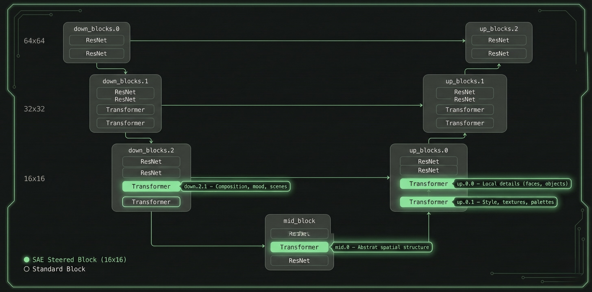
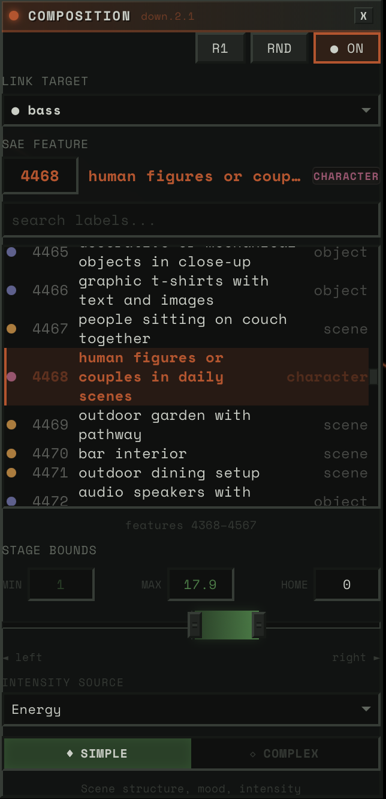
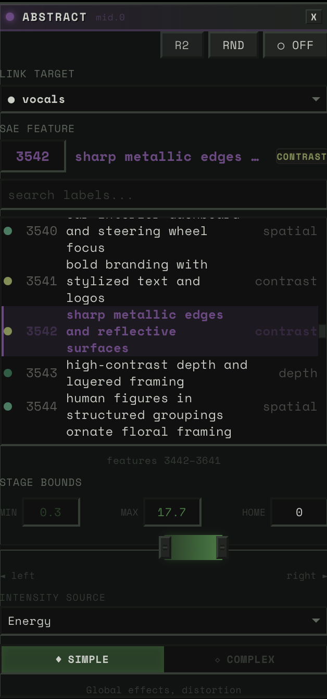
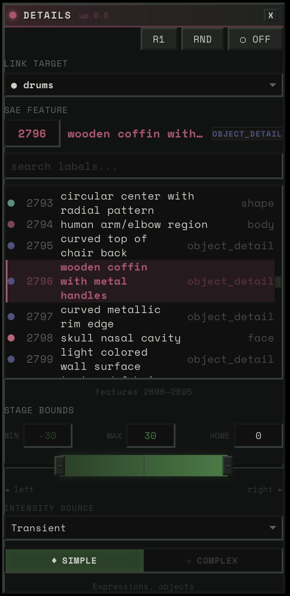
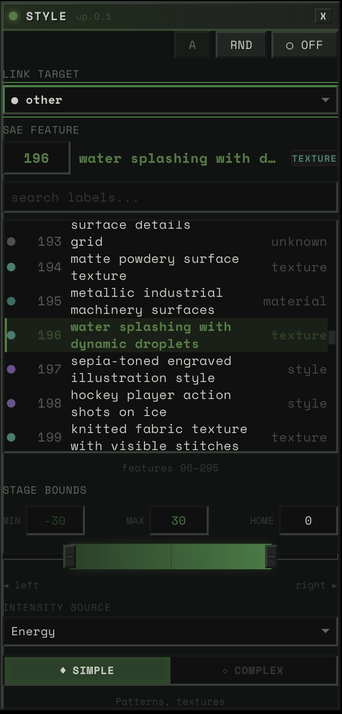
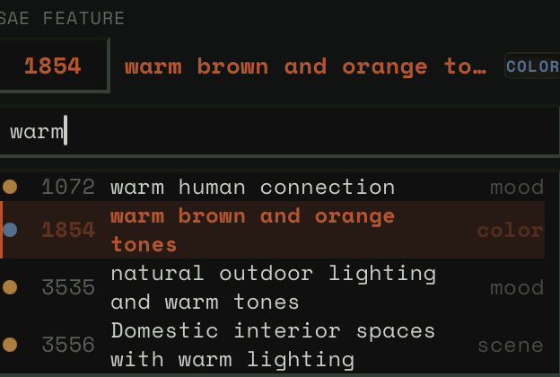
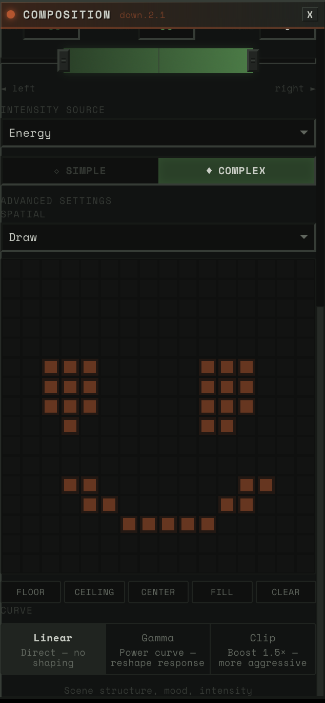
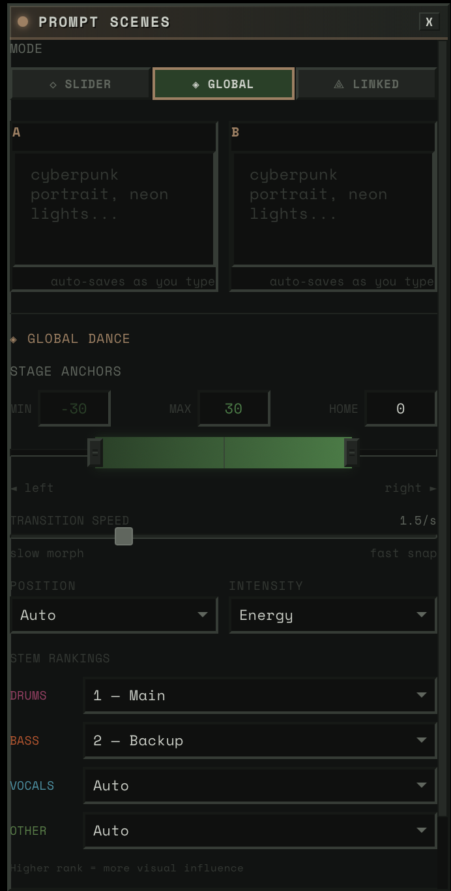
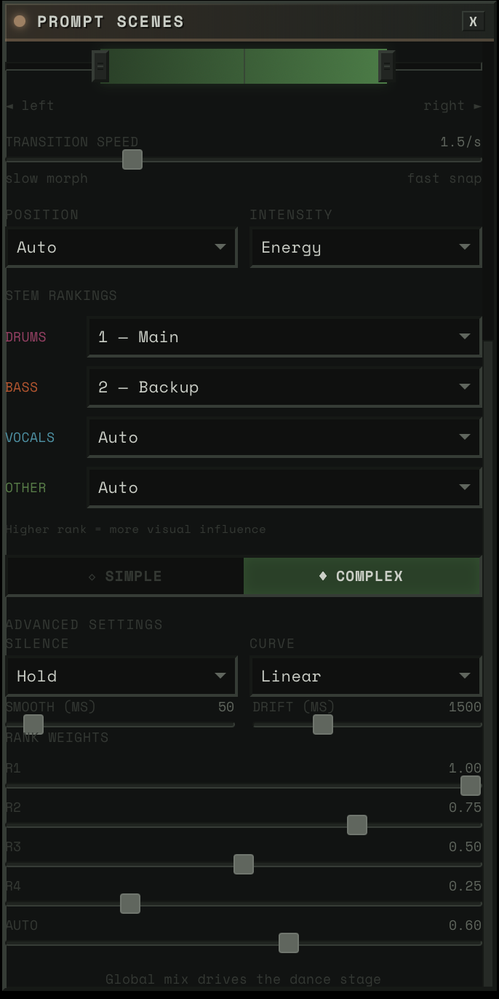
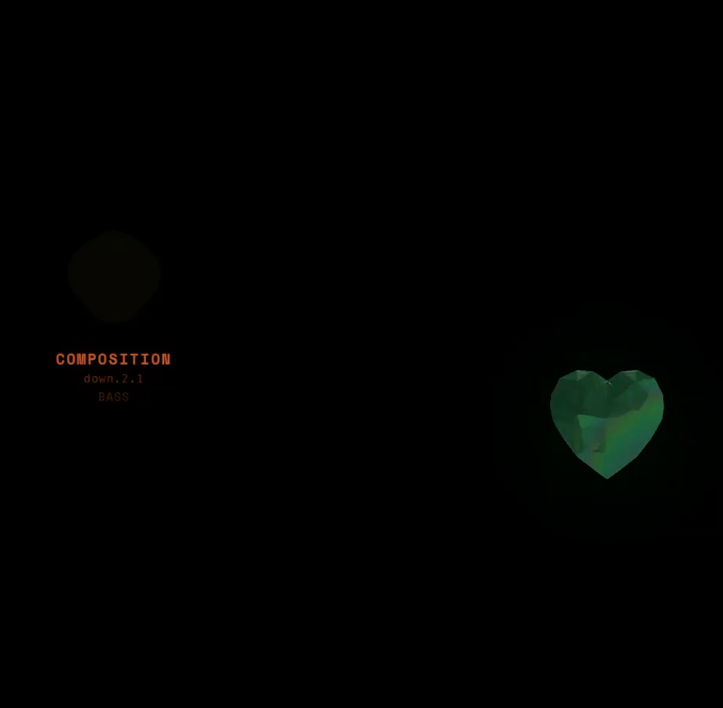

<div style="position: relative; padding-bottom: 56.25%; height: 0; overflow: hidden; border-radius: 8px;">
  <iframe src="https://www.youtube.com/embed/OOtSUKUOLHM" frameborder="0" allowfullscreen style="position: absolute; top: 0; left: 0; width: 100%; height: 100%;" />
</div>

---

Real-time diffusion at 50 FPS. SAE-steered, audio-reactive, on a single RTX 5090.

This is the engineering writeup for hambajuba2ba — a music visualizer that steers SDXL-Turbo's generation process using Sparse Autoencoder features mapped to audio in real time. The system has two halves: _building the features_ (the ML engine, the audio pipeline, the labeling) and _playing the features_ (the bridge, the tools, the interface that ties it all together as an instrument). For the vision and philosophy behind this project, read [Letting Computers Dance](/blog/letting-computers-dance).

Everything here was built with Claude as a pair programmer.

---

## Part I: Building the Features

---

### The Frame Budget

At 50 FPS, you get 20ms per frame. Here's where the time goes:

```
Steering computation (audio → physics → SAE config):   ~1.5ms
Spatial mask + prompt SLERP + noise lookup:             ~0.7ms
GPU inference (UNet + Euler + VAE + uint8 conversion):  ~14ms
Device-to-host memcpy:                                  ~0.8ms
JPEG encode (TurboJPEG, background thread):             ~1.5ms (overlapped)
────────────────────────────────────────────────────────────────
Total:                                                  ~17ms
```

Engine inference dominates at ~14ms. Everything else — the entire audio processing, physics simulation, SAE parameter computation, spatial mask selection, prompt interpolation, noise generation — fits in ~2.2ms. The design principle: make the bridge negligible so GPU inference gets the full budget.

---

### The Engine

#### Collapsing the Scheduler

SDXL-Turbo does 1-step inference. This is the key enabler. With `num_inference_steps=1`, the entire Euler scheduler collapses to five tensor operations:

```python
noisy  = latent + noise * sigma              # sigma ≈ 14.6
scaled = noisy * (1 / sqrt(sigma² + 1))      # ≈ 0.068
pred   = unet(scaled, timestep, embeds, cond)
x0     = noisy - sigma * pred                # euler step, sigma_next=0
image  = vae.decode(x0 / scaling_factor)
```

No loops, no scheduler state machine, no dynamic tensor shapes. The whole thing lives inside a single CUDA graph.

We bypass [diffusers](https://github.com/huggingface/diffusers)' `Pipeline.__call__()` entirely and implement these five operations directly in `engine.py`. Diffusers is great for flexibility — it's terrible for compiled inference where every Python call is a potential graph break.

#### The Compilation Strategy

```python
torch.compile(
    self._generate_impl,
    fullgraph=True,        # one graph, zero breaks
    mode="reduce-overhead", # CUDA graph capture
    dynamic=False,          # fixed shapes
)
```

**`fullgraph=True`** means the entire forward pass — noise addition, UNet, Euler step, VAE decode, float-to-uint8 conversion — is one computation graph. Any Python callback, data-dependent branch, or Dynamo-incompatible op fails compilation. Aggressive, but gives us zero Python overhead at inference.

**`reduce-overhead`** enables CUDA graph capture. After warmup, PyTorch records all GPU operations into a graph that replays with a single kernel launch. The alternative — `max-autotune` — additionally runs Triton's autotuner for custom matmul kernels. We can't use it: Triton's `TritonGPUAccelerateMatmul` MLIR pass crashes on Blackwell (compute capability 120, i.e. RTX 5090). cuBLAS handles Blackwell fine — its kernels are compiled by NVIDIA per-architecture. Performance difference is likely &lt;5% for SDXL's matmul shapes.

**`dynamic=False`** because all shapes are fixed: `(1, 4, 64, 64)` latents, `(1, 77, 2048)` prompt embeddings. Static shapes let the graph be fully specialized.

#### The `copy_()`/`fill_()` Pattern

CUDA graphs record operations at fixed memory addresses. Creating new tensors allocates at new addresses — the graph would then read stale data. The solution: every mutable tensor in the hot path uses in-place operations. `fill_()` for scalars, `copy_()` for buffers. Same address, different values. The graph stays valid.

This applies everywhere: SAE steering strengths, feature directions, spatial masks, prompt SLERP buffers, noise composition outputs. If it changes per-frame, it's an in-place write.

---

### SAE Steering: The Engineering Crux

Sparse Autoencoders (Surkov et al., NeurIPS 2025) decompose UNet activations into 5,120 interpretable features per block. Each feature is a column of the SAE decoder weight matrix — a 1280-dimensional unit-norm vector representing a learned concept. To steer, you add a scaled feature direction to the attention output:

```
activations += strength * feature_direction
```

The standard approach: PyTorch forward hooks. Register a callback on the attention block, modify the output, continue. This is what the paper's SAEPaint demo uses.

**Hooks break `torch.compile(fullgraph=True)`.** They're Python callbacks — opaque to Dynamo's tracer. Each hook creates a graph break. With CUDA graphs, the GPU would need to stop, signal the CPU, run Python, then resume.

#### The Solution: SteeredModule Wrappers

Replace the module itself with an `nn.Module` wrapper that includes steering as pure tensor math:

```python
class SteeredModule(nn.Module):
    def __init__(self, original_module, decoder_weight):
        super().__init__()
        self.module = original_module

        # All mutable state as registered buffers
        self.register_buffer("direction", torch.zeros(1280))
        self.register_buffer("strength", torch.zeros(1))
        self.register_buffer("activation_map", torch.ones(1, 1, 1))

    def forward(self, hidden_states, *args, **kwargs):
        result = self.module(hidden_states, *args, **kwargs)
        out = result[0]
        C = out.shape[1]

        steering = (self.strength * self.activation_map).unsqueeze(1) \
                   * self.direction.view(1, C, 1, 1)
        out = out + steering
        return (out,)
```

Why this works:

1. **Registered buffers** are visible to Dynamo. Part of the module's state dict, not Python attributes.
2. **`copy_()`/`fill_()` for updates.** The CUDA graph has baked-in memory addresses. In-place ops write to the same address.
3. **No Python in the forward path.** Pure tensor arithmetic. Dynamo traces it directly.
4. **Always executes.** Even when `strength=0`. The CUDA graph can't branch. A no-op multiply-add is cheaper than a graph break.

We walk the UNet module tree at init time and surgically replace four attention blocks:

| Block | UNet Path | What It Controls |
|-------|-----------|-----------------|
| `down.2.1` | `down_blocks.2.attentions.1` | Composition, mood, scenes |
| `mid.0` | `mid_block.attentions.0` | Abstract spatial structure |
| `up.0.0` | `up_blocks.0.attentions.0` | Local details (faces, objects) |
| `up.0.1` | `up_blocks.0.attentions.1` | Style, textures, palettes |

All operate at 16x16 spatial resolution. The `activation_map` buffer enables per-pixel steering — features can be applied selectively to specific regions of the image.



<div class="not-prose" style="display: grid; grid-template-columns: 1fr 1fr; gap: 8px; max-width: 640px; margin: 1rem auto;">









</div>

#### Two-Tier Update Dispatch

Feature directions rarely change (user selects a feature). Strengths change every frame (audio-driven). The pipeline caches feature IDs:

```python
if current_features != self._last_feature_ids:
    manager.set_steering(steerings)      # copy decoder columns → expensive
else:
    manager.update_strengths(steerings)   # fill_() on scalars → cheap
```

The hot path is a single `fill_()` per block. Four scalar writes per frame.

#### Mean-Activation Scaling

Raw steering strength is scaled by each feature's historical mean activation (computed during SAE training over LAION-COCO). Values range from ~9 to ~68. This means `strength=1.0` produces roughly one standard deviation of that feature's natural activation — perceptually consistent across features.

Critical optimization: all 20,480 mean values are bulk-transferred to CPU floats at init time. Without this, each `.item()` call triggers `cudaDeviceSynchronize` at 1-3ms each. At 50 FPS with 4 blocks, that would be 200-600ms/s of unnecessary sync.

---

### Labeling 20,480 Features for \$85

The original paper (Surkov et al., NeurIPS 2025) only labeled the `down.2.1` block — and never published those labels. They explicitly said VLM labeling was "unsatisfactory" for the other three blocks with subtler visual effects.

#### What Failed: CLIP Direction Subtraction

Our first attempt: for each feature, generate ON/OFF images, embed with SigLIP, subtract the directions, match against a vocabulary.

Max confidence across all 20,480 features: 0.19. Known feature 2301 ("intense/evil") got labeled "crowd" at 0.11. Root cause: single seed + empty prompt means every image starts from the same grey blob. Features need semantic context to express themselves — the CLIP direction captures "how this grey blob changed" rather than what the feature actually means.

#### What Worked: A VLM Ensemble

No single method works for all four blocks. Composition features (down.2.1) are easy for VLMs to describe. Spatial structure features (mid.0) need spatial analysis, not visual description. Texture features (up.0.1) are the hardest — even three VLMs struggle to verbalize visual patterns.

We built an ensemble:

**Generate 50K images** on a [Modal](https://modal.com) A100 with activation logging — for each image, record which features fired and where. ~\$10.

**Rank images per feature** with block-specific metrics. This was a key design decision. Composition features (down.2.1) activate globally across the image, so we rank by mean activation. Detail features (up.0.0) fire locally, so we rank by max activation and crop the images to the region of peak activity. Texture features (up.0.1) are semi-global, so we rank by sum. Different blocks need different lenses.


**Three VLMs via [OpenRouter](https://openrouter.ai)** with block-specific prompts. This matters enormously — a generic "describe what's different" prompt fails, but "IGNORE the subject matter, focus ONLY on visual properties" for the texture block succeeds. Qwen3-VL-235B first (\$12), GLM-4.6V second (\$27), Kimi K2.5 as tiebreaker (\$36).

The Kimi pass had an accident. A bug in disagreement detection (exact string match instead of semantic similarity) triggered a 99% false disagreement rate, so Kimi annotated 88% of features instead of ~30%. By the time we caught it, the money was spent. Turned out to be the best accident of the project — Kimi's over-annotation pushed high-confidence labels from 42% to 71% on the detail block and from 26% to 62% on the texture block.

**Spatial analysis for mid.0** — instead of asking VLMs what these abstract features look like, we averaged the 16x16 spatial heatmaps from their top-100 activating images. Turns out mid.0 features are primarily about WHERE things happen in the image, not WHAT. "Spatial: center," "spatial: border," "horizontal band." 93% of mid.0 labels came from this analysis, not VLMs.

**TF-IDF as tiebreaker** — for each feature, what prompts are statistically distinctive among its top-activating images? When two VLMs disagree, the one whose label aligns with the TF-IDF terms wins. Free, zero-cost signal.

**Label fusion** — priority-ordered: spatial override → VLM consensus → TF-IDF alignment → best guess.

Result: 77.4% high-confidence labels. Ground-truth accuracy: 14/16 (87.5%). Total cost: ~\$85. The paper's single-VLM approach would have been ~\$2,860.

---

### The Audio Pipeline: Offline Everything

All DSP runs at upload time. Runtime is O(1) array interpolation.

#### Stem Separation

[Demucs](https://github.com/facebookresearch/demucs) (htdemucs_ft) splits audio into 4 stems: bass, drums, vocals, other. Then Linkwitz-Riley LR-4 crossover filters produce 5 virtual sub-bands — drums_low (kick), drums_mid (snare), drums_high (hats), other_mid (guitars/keys), other_high (shimmer/air). Total: 9 stems. Zero-phase filtering via `sosfiltfilt` — acausal but no phase distortion, which is fine for offline.

#### Perceptual Feature Extraction

Each stem gets ~20 feature channels. The goal is to capture how humans _perceive_ the music, not just what the signal is doing.

**Asymmetric envelope following** — the workhorse channel. Human loudness perception is fundamentally asymmetric: we notice attacks instantly but perceive decay as gradual. A one-pole IIR filter with state-dependent coefficient:

```python
coeff = attack_coeff if x > state else release_coeff
state += coeff * (x - state)
```

Per-stem presets tuned for character: drums get 2ms attack / 100ms release (50:1 ratio — ultra-punchy), vocals get 15ms / 150ms (10:1 — musical phrasing). The ratio determines the feel.

**Dual-layer response** — two envelope followers with different time constants on the same energy: flash (1-5ms attack, 20-80ms release) for the immediate "pop," and sustain (10-30ms attack, 100-250ms release) for the trailing "glow." Creates a comet-tail effect. The system can sample either layer independently.

**Spectral flux** — the rate of spectral change. More discriminative than raw energy for rhythmic events because it responds to timbral changes, not just loudness. A soft violin entrance registers as high flux even though it's quiet.

**Peak detection** — binary transient mask from spectral flux via adaptive thresholding. When this fires, it means: _something just hit_.

**Spectral centroid (brightness)** and **spectral flatness (tonality)** — centroid is the "center of mass" of the spectrum (high = bright/sharp, low = warm/dull). Flatness measures tonal vs. noise-like character (0 = pitched instrument, 1 = hi-hat). Used for Bouba/Kiki audio-visual correspondence — the psychoacoustic mapping where angular visuals correspond to harsh sounds and round visuals to tonal sounds.

**HPSS** — harmonic-percussive source separation via median filtering (Fitzgerald, 2010) in the spectrogram domain. The ratio gates subsequent analysis: if a stem is >70% percussive, we skip harmonic features entirely (no point tracking pitch on a drum stem).

**Psychoacoustic roughness** — the Sethares/Plomp-Levelt dissonance model. For each frame: find spectral peaks, compute all pairwise critical-bandwidth interactions, sum dissonance. Fully vectorized via NumPy broadcasting (~50x over per-frame loops). This gives us _tension_ — how rough and dissonant the current moment sounds. Drives harmonic-aware scene transitions.

**Tonal distance** — Jensen-Shannon divergence between each frame's chroma and the track average. Measures "how far from the home key." Key-agnostic: a modulation from C major to A minor reads as departure regardless of absolute key.

**Pitch tracking** — [PESTO](https://github.com/SonyCSLParis/pesto) (monophonic, 12x faster than CREPE) for vocals and bass. [Basic Pitch](https://github.com/spotify/basic-pitch) (Spotify, polyphonic ONNX) for the "other" stem. Output: pitch_hz, pitch_confidence, pitch_normalized [0,1] for spatial mapping.

**Multi-timescale novelty** — spectral flux smoothed at three BPM-scaled windows: ~0.5s (transients/fills), ~4s (phrase boundaries), ~16s (section changes/drops). Layer detection: new instrument entries via normalized flux + flatness change, debounced at 500ms.

#### Cross-Stem Coupling

The system also tracks musical _relationships_ between stems.

**Phase Locking Value (PLV)** — Hilbert transform to extract instantaneous phase, then compute phase synchrony (Lachaux et al., 1999) in a sliding window. 1.0 = perfectly locked.

**Lock index** — weighted composite: envelope correlation (40%), PLV (35%), onset synchrony (25%). Above 0.7 = "in the pocket" (rhythmically locked). Below 0.3 = independent. This drives the Dancer Ensemble's coupling bonus — stems that groove together get visual reinforcement.

**Call-response** — XOR of binary activity masks, smoothed. High when exactly one stem is active while the other is quiet. Drives alternating visual focus.

#### Runtime: `np.interp()`

At runtime, sampling a feature is one call: `float(np.interp(t, timestamps, data))`. No FFT, no filtering, no computation. 9 stems x ~8 channels x 50 FPS = ~3,600 interpolation calls per second. Negligible.

This is why 50 FPS is achievable. The audio bridge adds ~1-2ms per frame, not 50ms.

---

## Part II: Playing the Features

Part I produces two things: a compiled CUDA graph that steers SDXL-Turbo's generation via SAE features at four attention blocks, and pre-computed audio feature arrays for every stem. Part II is the _instrument_ — how those features become interactive tools for navigating the model's space through music.

---

### The Block Config Panel: Anatomy of the Instrument

Each of the four UNet blocks gets its own panel. This is the primary control surface — where the user decides what the model expresses and how it responds to music.

<div style="max-width: 420px; margin: 1rem auto;">


</div>

#### Link Target

A dropdown of ~20 audio sources. Physical stems (bass, drums, vocals, other), virtual sub-bands (drums_low, drums_high, other_mid, other_high), HPSS components (bass_harmonic, drums_percussive), and derived signals (tension, global).

When you pick a link target, two things happen: (1) that stem's audio features drive this block's steering strength, and (2) if auto-config is on, the system classifies the stem and auto-derives everything else — physics preset, intensity source, spatial mask, response layer.

#### SAE Feature

The feature picker lets you browse 5,120 features per block. Three modes:

- **Neighborhood view**: ~200 features centered on the current selection, scrollable. This is the default — you see features near the one you have, organized by similarity.
- **Search**: Type a concept ("fire," "faces," "blue") and filter all 5,120 by label and category.
- **Direct ID**: Numeric input for jumping to any feature by number.

27 category colors (scene, character, texture, mood, color, spatial, style...). Each feature shows its label, category tag, and confidence level.

<div style="max-width: 420px; margin: 1rem auto;">



</div>

#### Stage Bounds (Strength Range)

Three-handle slider: `stage_left` (min), `stage_home` (rest), `stage_right` (max). Default: [-30, 0, +30].

This is the "dance model" geometry. When audio energy is zero, the steering strength sits at `stage_home`. As energy rises, it moves toward `stage_right` (or `stage_left` for negative features). The physics determine _how_ it moves — bouncy, smooth, snappy.

Think of it as: how far can this stem push the feature? A narrow range [-5, 0, +5] means subtle influence. A wide range [-30, 0, +30] means dramatic swings.

#### Intensity Source

What audio channel drives the block's activation:

- **energy_smooth**: Asymmetric-envelope RMS — the default, most musical. Fast attack catches transients, slow release preserves phrasing.
- **transient**: Binary peak detection — only fires on hits. Sharp, staccato response.
- **flux**: Spectral change rate — responds to timbral changes, not just loudness.
- **envelope**: Raw RMS — unsmoothed, direct, jittery.

#### Rank (Dancer Role)

Each block gets a rank that determines how much visual attention its stem gets:

| Rank | Label | Base Weight | Character |
|------|-------|-------------|-----------|
| R1 | Lead | 1.0 | Primary visual focus |
| R2 | Support | 0.65 | Visible, complementary |
| R3 | Background | 0.40 | Ambient presence |
| R4 | Subtle | 0.25 | Barely there |
| A | Auto | 0.05 | Available for surprise promotion |

These aren't just static weights — they're dynamically modulated by what the music is doing. More on this in the Dancer Ensemble section below.

#### Auto / Manual Toggle

**Auto mode**: Pick a stem, everything else is derived. The system classifies your stem (percussive vs harmonic, rhythmic vs melodic, frequency range) and auto-selects: physics preset, intensity source, response layer, spatial mask. This is the fast path — pick a stem, pick a feature, play.

**Manual mode**: Full control. Physics presets, spatial painting, intensity curves, gamma adjustments.

#### Advanced Controls (Manual Only)

**Spatial mode** — draw or pitch-aligned (see next section).

**Intensity curve** — linear (direct), gamma (power curve with adjustable exponent), or clip (1.5x boost). Gamma < 1 emphasizes quiet passages. Gamma > 1 emphasizes peaks.

---

### Spatial Maps: Painting With Concepts

This is inspired by Goodfire's [Paint With Ember](https://www.goodfire.ai/research/painting-with-concepts) research. Their key insight: SAE features operate on a 16x16 patch grid — the same spatial resolution as the UNet's attention blocks. Instead of applying a feature uniformly across the entire image, you can paint it onto specific regions.

We implement this as the `activation_map` buffer in each `SteeredModule`. A 16x16 grid of weights from 0.0 to 1.0 that multiplies the steering strength at each spatial position. Where the mask is bright, the feature is fully expressed. Where it's dark, no steering occurs.

#### Draw Mode

A 16x16 paintable canvas in the Block Config Panel. Left-click paints cells on, right-click paints them off. Five preset buttons for common patterns:

- **Floor**: Bottom half lit (bass, kick — grounding)
- **Ceiling**: Top half lit (hats, shimmer — ethereal)
- **Center**: Middle band lit (vocals, melody — focal point)
- **Fill**: Everything on (uniform steering)
- **Clear**: Everything off

<div style="max-width: 420px; margin: 1rem auto;">



</div>

You can paint arbitrary shapes. Want "intensity" only in the left third of the image? Paint it. Want "faces" only in the center? Paint it. The mask is immediately uploaded to GPU via `copy_()` and takes effect on the next frame.

#### Pitch-Aligned Mode

The spatial mask moves automatically with the music's pitch.

12 pre-computed Gaussian masks on GPU, one per chromatic pitch level. Low pitch (bass notes) → mask centered at the bottom of the image. High pitch (treble) → mask centered at the top. Spread = 0.25 → each Gaussian covers ~50% of vertical space, so transitions are smooth.

At runtime, the system samples the stem's normalized pitch via `np.interp()`, maps it to a mask index [0-11], and writes the corresponding Gaussian to the activation_map buffer. The effect: a bass line playing low notes steers the bottom of the image, and as the melody rises, the steering follows it upward. Natural spatial-frequency correspondence.

#### How Spatial Maps Interact With Audio

Spatial maps combined with other axes produce distinctive results:

- **Bass on down.2.1 with floor mask**: The mood/composition shifts only in the lower half of the image. The top stays stable. The image has a _horizon_ that responds to low-end energy.
- **Vocals on up.0.0 with pitch-aligned mask**: Faces and details appear and disappear at the vertical position matching the vocal pitch. The image has a _focus point_ that tracks the melody.
- **Drums on mid.0 with center mask**: Abstract structural shifts concentrated in the middle. The frame borders stay stable while the center pulses.

These combinations aren't programmed — they emerge from the user's choices. And because everything updates in real time, you can experiment: paint a mask, hear what it does, repaint.

---

### The Bridge: Physics Between Audio and Visuals

Directly mapping audio amplitude to visual intensity is mechanical and jittery. The bridge sits between audio features and SAE steering, transforming reactive signals into organic motion.

#### Mass-Spring-Damper

```
F = -k(position - target) - c·velocity
```

The audio feature sets the target. Physics determines how the steering value _reaches_ it. The damping ratio `ζ = c / (2√(km))` determines character:

| ζ Range | Behavior | Feel | Used For |
|---------|----------|------|----------|
| < 1 | Underdamped | Bounce, overshoot | Drums (ζ≈0.45), vocals (ζ≈0.70) |
| ≈ 1 | Critically damped | Instant, no overshoot | Linear preset |
| > 1 | Overdamped | Slow, weighty approach | Ambient (ζ≈1.25) |

Research: ζ = 0.4–0.7 feels most organic for music visualization. All drum presets sit in this range.

#### BPM Scaling

Physics presets are designed for 120 BPM. For other tempos:

```
k' = k · (bpm / 120)
c' = c · √(bpm / 120)
```

This preserves ζ at any tempo. A 140 BPM track gets faster physics but the same bounce character. A 90 BPM track gets slower, heavier response. The spring constant scales linearly with tempo; damping scales with the square root to maintain the damping ratio.

Semi-implicit Euler integration (velocity-first, then position) for energy preservation in underdamped oscillations.

#### Sustained Physics Models

A mass-spring-damper settles to equilibrium. That's fine for drums — they hit and decay. But for pads, drones, and sustained vocals, settling = visual death. Three alternative models that never settle:

**PitchFollowingPhysics**: Maps pitch Hz to position (log scale, 80-2000 Hz range). Smoothly follows the melody. Confidence gates tracking — during unvoiced segments, the position holds rather than jumping. For vocals and lead instruments.

**CoupledOscillatorPhysics**: Two virtual oscillators at slightly different frequencies (0.3Hz and 0.47Hz) coupled by a spring. The frequency mismatch creates beating patterns — perpetual "breathing" motion. Energy controls coupling strength and amplitude. For pads and drones.

**PerlinDriftPhysics**: [OpenSimplex](https://github.com/lmas/opensimplex) noise for smooth, never-repeating drift. Energy controls speed through noise space. For ambient and textural content.

All three support percussion interaction: when a drum hit occurs, sustained models receive an impulse that temporarily tightens damping and injects velocity. This means a pad drone's visual breathing gets kicked by the beat.

#### BlendedPhysics: Classification-Driven

Each stem is auto-classified from its audio features (HPSS ratio, onset density, pitch confidence, spectral flatness). The classification determines the weight blend:

```python
spring         = percussive_confidence      # drums: ~0.85
pitch_follow   = melody_confidence * harmonic_confidence  # vocals: ~0.5
oscillator     = harmony_confidence * harmonic_confidence  # pads: ~0.4
perlin         = texture_confidence * harmonic_confidence  # ambient: ~0.3
```

Key: harmonic models are gated by `harmonic_confidence`. A purely percussive stem routes 100% to spring — no pitch following, no oscillation. The classification drives the blend automatically.

---

### The Four Axes

Four parallel control systems, each manipulating a different dimension of generation. They converge in the CUDA graph.

#### Axis 1: SAE Steering (WHAT is expressed)

Per-stem energy → physics → strength → `SteeredModule.strength.fill_()`. The feature direction determines what concept is being injected. The spatial mask determines where. The physics determine how the strength evolves over time. The prominence determines how much this stem matters relative to others.

#### Axis 2: Spatial Masks (WHERE features are applied)

The 16x16 activation map on each block. Draw mode for user-designed regions. Pitch-aligned mode for melody-tracking masks. Auto-config selects presets based on stem classification: bass → floor, high → ceiling, melodic → center.

#### Axis 3: Prompt Destinations (WHERE in prompt space)

SLERP between two prompt embedding pairs (A and B). Three modes:

- **Slider**: User controls the crossfader directly. VDJ-style scene blending.
- **Reactive**: Audio drives blend position globally. Weighted average across active stems using rank-based weights. When the music is energetic, it pushes toward B. Quiet passages drift back toward A.
- **Linked**: A specific audio source drives the blend via the dance model — position source and intensity source determine where you lean and how far. Tension as position source = harmonic dissonance drives scene transitions. Brilliant for songs with key changes.

When a new destination is loaded: the current blended state freezes as A, the new destination becomes B, blend resets to 0. You always travel FROM where you are TO somewhere new.

<div style="max-width: 420px; margin: 1rem auto;">





</div>

#### Axis 4: Noise Composition (HOW the latent base evolves)

Circular walk between two pre-computed noise tensors:

```python
noise(θ) = cos(θ) · noise_a + sin(θ) · noise_b
```

The angle is pre-computed from two signals blended by content type:

- **Beat angles**: Energy x 2π per beat with cubic ease-in-out. High-energy beats → full revolution. Quiet beats → less rotation.
- **Drift angles**: Tonal distance → angular displacement. Home key = no drift. Maximum harmonic departure = π/2.
- **Beat weight**: Transient-to-energy ratio. Percussive content → beats dominate. Sustained content → drift dominates.

Distance property controls how far each beat moves around the circle. 0 = static noise. 1 = full revolution per energetic beat. The composition panel has two seed slots, a distance slider, and mode selection (auto/pulse/continuous).

<div style="max-width: 420px; margin: 1rem auto;">


</div>

---

### The Dancer Ensemble: How Stems Share the Stage

Multiple stems need to feel like they're performing together.

#### Static Ranks, Dynamic Prominence

The user assigns ranks (R1–R4 or Auto). The ProminenceEngine transforms these into frame-by-frame prominence values using five dynamic modulations:

**Novelty boost (+30% max)**: When a stem's novelty derivative is rising — it's doing something new — it earns temporary extra attention. A fill, an ornament, a new riff.

**Coupling bonus (+50% max)**: When stems at the same rank have high lock_index (>0.5), they reinforce each other. Drums and bass locked into a groove both get brighter. This is "dancing together."

**Call-response (x0.6 to x1.3)**: For same-rank stems with alternating activity patterns, the currently "calling" stem (louder) gets boosted while the "responding" stem fades. Creates a ping-pong visual focus that tracks the musical conversation.

**Activity gate (x0 to x1)**: Below -40dB, the gate closes. Silent stems fade out gracefully. No visual energy wasted on stems that aren't playing.

**Surprise promotion (Auto stems only)**: An unranked stem sits at 0.05 prominence — barely there. When the system detects a layer entry (new instrument enters the mix) or strong novelty, the stem jumps to ~0.7 (near rank-1 level) and decays over ~3 seconds. The user sees the visualizer "catch" a saxophone solo or a new synth layer they hadn't assigned a rank to.

```
prominence = base × (1 + novelty + coupling) × call_response × activity_gate + surprise
```

Clamped to [0, 1]. This means: a rank-1 stem with high novelty, locked in with its peers, actively playing, can reach 1.0. A rank-4 stem that's silent fades to near zero. An auto stem that was invisible suddenly surges when it enters the arrangement.



#### The Dance Model

Each block has a dance model that maps audio to the strength range:

```
position_value = stage_left + position × (stage_right - stage_left)
output = stage_home + intensity × (position_value - stage_home)
```

**Position source** determines WHERE in the range: pitch, chroma, brightness, or tension.
**Intensity source** determines HOW FAR from home: energy_smooth, transient, flux, or envelope.

When intensity = 0, output stays at home. When intensity = 1, output reaches full position. Natural "lean into the music" behavior.

Silence behavior: either hold the last known position (default) or drift back to home with a 1500ms time constant.

#### How It Looks: Orbs, Flowers, and Tendrils


Each UNet block is visualized as a **flower orb** rendered with GLSL shaders:

- **Bloom state**: Enabled blocks bloom open, disabled blocks show as closed buds
- **Activity**: Driven by energy_smooth — petals tremble, core pulses
- **Flutter**: Triggered by flash (transient detection) — fast attack, slow decay
- **Color**: Per-stem — bass (warm orange), drums (magenta), vocals (cyan), other (green)

**Tendrils** connect each orb to the CrystalHeart via Canvas2D cubic beziers:

- Audio-reactive displacement: envelope-driven waveform amplitude + simplex noise
- Tapered width: thick at the orb, thin at the heart
- Four rendering layers: glow, main stem, bright core, and traveling pulses
- On transients (flash > 0.5), a glowing dot travels from flower to heart

The orbs are draggable via [Matter.js](https://brm.io/matter-js/) physics — they bounce, they have inertia, they respond to each other. The heart pulses to the BPM.

---

### Delivery: Getting Frames to the Browser

#### Double-Buffered Encoding

While the GPU computes frame N+1, the CPU encodes frame N as JPEG via [TurboJPEG](https://libjpeg-turbo.org) (5-10x faster than Pillow, releases the GIL) in a background thread:

```
Frame N:     [GPU inference] [D2H]  [start encode]
Frame N+1:   [collect N]    [GPU inference] [D2H]  [start encode]
```

With backpressure: if the encoder is still busy and the pending frame is older than one interval, skip GPU work entirely. Repeated frames are better than growing latency.

#### The RuthlessConsumer

Frames are delivered over WebSocket as raw binary JPEG. The consumer enforces strict timing:

- Frame >50ms late → **drop it**. Audio-visual sync matters more than frame rate.
- Frame ahead of schedule → sleep until due.
- Queue overflow → drop oldest down to target depth.

**Predictive lookahead**: frames are generated for `audio_time + pipeline_latency + frame_interval + client_render_latency`. This compensates for pipeline delay so visuals match the audio the user hears at delivery time.

#### The Desktop Shell

The frontend runs inside [Electrobun](https://electrobun.dev) — a Bun-native alternative to Electron that uses the system webview instead of bundling Chromium. Native macOS window effects (vibrancy, transparency) via Objective-C bindings. The entire desktop app is a single lightweight binary talking to the Python backend over WebSocket.

---

### Architecture Diagram

```
┌─ Audio Upload (Offline, Once) ────────────────────────────────────┐
│                                                                    │
│  Audio File → Demucs → 4 stems → LR-4 → 9 stems                 │
│      → 5-phase perceptual DSP → ~20 channels per stem             │
│      → Cross-stem coupling (PLV, lock index, call-response)       │
│      → Beat detection (Beat This!) → BPM, beat grid              │
│      → ComponentClassification per stem                           │
│                                                                    │
│  Result: Pre-computed float32 arrays, O(1) runtime sampling       │
└───────────────────────────────────────────────────────────────────┘

┌─ Runtime (50 FPS) ────────────────────────────────────────────────┐
│                                                                    │
│  AudioClock (PLL drift correction from frontend time updates)     │
│      ↓                                                             │
│  AudioSampler (np.interp into pre-computed arrays)                │
│      ↓                                                             │
│  ┌────────────┐ ┌────────────┐ ┌──────────────┐ ┌─────────────┐  │
│  │ Physics    │ │ Spatial    │ │ Destination  │ │ Composition │  │
│  │ Manager    │ │ Manager    │ │ Modulator    │ │ Engine      │  │
│  │            │ │            │ │              │ │             │  │
│  │ Blended    │ │ Draw or    │ │ SLERP in     │ │ cos/sin     │  │
│  │ spring +   │ │ pitch →    │ │ prompt embed │ │ circular    │  │
│  │ pitch +    │ │ Gaussian   │ │ space        │ │ walk        │  │
│  │ oscillator │ │ masks      │ │              │ │             │  │
│  │ + perlin   │ │            │ │              │ │             │  │
│  └─────┬──────┘ └─────┬──────┘ └──────┬───────┘ └──────┬──────┘  │
│        ↓              ↓               ↓                ↓          │
│  ┌─────────────── CUDA Graph ──────────────────────────────────┐  │
│  │                                                              │  │
│  │  noisy = latent + noise * sigma                             │  │
│  │  scaled = noisy * input_scale                               │  │
│  │  pred = UNet(scaled, timestep, embeds, cond)                │  │
│  │      └── SteeredModule at 4 blocks:                         │  │
│  │          out = attention(x) + (strength * mask) * direction │  │
│  │  x0 = noisy - sigma * pred                                 │  │
│  │  image = TinyVAE.decode(x0 / scale)                        │  │
│  │  uint8 = clamp(image * 0.5 + 0.5) * 255                   │  │
│  │                                                              │  │
│  └──────────────────────────────────────────────────────────────┘  │
│        ↓                                                           │
│  D2H memcpy → TurboJPEG (background thread) → WebSocket          │
│        ↓                                                           │
│  RuthlessConsumer (drop late, pace ahead, strict sync)            │
└───────────────────────────────────────────────────────────────────┘
```

---

### Limitations

- **512x512 output** — SDXL-Turbo at 512x512 is the sweet spot for speed. Higher resolution would require a different model or upscaling.
- **77.4% label confidence** — ~22% of features have medium or low-confidence labels. The texture block (up.0.1) is weakest at 62% high-confidence.
- **Single-seed composition** — the circular walk explores a 2D subspace of noise space. Adding more seeds would increase diversity but complicate the beat-sync math.

---

### What Claude Looked Like as a Pair Programmer

Claude didn't write the architecture. I knew I needed inline steering because hooks break compile — that insight came from days of debugging `torch._dynamo` graph breaks. Claude helped me implement `SteeredModule` cleanly, catch edge cases (like activation maps needing to be pre-allocated before warmup to bake shapes into the CUDA graph), and write the double-buffered encoding pipeline.

The audio DSP was mostly Claude executing on my specifications. I described the asymmetric envelope behavior I wanted, the psychoacoustic roughness model, the Sethares reference. Claude implemented it, vectorized it, wrote the presets. The physics system was collaborative — I wanted mass-spring-damper, Claude worked out the BPM-scaling math to preserve damping ratio.

The labeling pipeline was the most collaborative. I designed the block-specific ranking metrics and the fusion priority system. Claude built the OpenRouter client, wrote the VLM prompts, implemented the TF-IDF supplement and spatial analysis.

I provided direction and taste — what should this feel like, what's the right abstraction, where to simplify. Claude provided implementation velocity — writing cleanly, catching edge cases, parallelizing work.

---

### References & Acknowledgments

This project builds on work from the interpretability and real-time generation communities:

- **[Surkov et al. — Interpreting and Steering Features in Images](https://sdxl-unbox.epfl.ch)** (EPFL, NeurIPS 2025) — The SAE training on SDXL-Turbo that makes steering possible. The foundation this project is built on. ([paper](https://www.lesswrong.com/posts/Quqekpvx8BGMMcaem/interpreting-and-steering-features-in-images))
- **[Our labels for all 20,480 features](https://huggingface.co/datasets/hammamiomar/sdxl-turbo-sae-labels)** — VLM ensemble labeling across all 4 blocks, published on HuggingFace.
- **[Goodfire: Painting with Concepts](https://www.goodfire.ai/research/painting-with-concepts)** — The insight that SAE features can be spatially painted onto generation at 16x16 resolution. Our spatial mask system builds directly on this.
- **[StreamDiffusion v2](https://streamdiffusionv2.github.io)** — Real-time diffusion pipeline techniques. Their stream batch and residual CFG work informed early architecture decisions.
- **[Overworld Engine](https://github.com/Overworldai/world_engine)** — Related work in real-time interactive generation.
- **[R4G: Representation for Generation](https://kdidi.netlify.app/blog/ml/2025-12-31-r4g/)** — Survey of how representation models (DINOv2, SigLIP) and generative models are converging. The direction we want to take steering next — navigating representation space, not just SAE features.
- **[Juice](https://garden.bradwoods.io/notes/design/juice)** (Brad Woods) — The design philosophy behind hambajuba's character and interaction feel. Redundant feedback channels, moment-to-moment satisfaction, the idea that soul emerges from abundantly fulfilling emotional requirements.

**Models & Tools:**

- **[SDXL-Turbo](https://huggingface.co/stabilityai/sdxl-turbo)** (Stability AI, Sauer et al.) — The core generation model. 1-step Adversarial Diffusion Distillation of SDXL.
- **[TAESDXL](https://huggingface.co/madebyollin/taesdxl)** (madebyollin) — Tiny Autoencoder for SDXL. Fast VAE decode.
- **[Demucs](https://github.com/facebookresearch/demucs)** (Meta/FAIR, Rouard et al.) — Hybrid Transformer source separation into 4 stems.
- **[Basic Pitch](https://github.com/spotify/basic-pitch)** (Spotify, Bittner et al., ICASSP 2022) — Polyphonic pitch tracking via lightweight ONNX model.
- **[PESTO](https://github.com/SonyCSLParis/pesto)** (Sony CSL) — Monophonic pitch estimation, 12x faster than CREPE.
- **[Beat This!](https://github.com/CPJKU/beat_this)** (CPJKU, ISMIR 2024) — State-of-the-art beat tracking.
- **[madmom](https://github.com/CPJKU/madmom)** (CPJKU, Bock et al.) — RNN-based onset detection.
- **[librosa](https://librosa.org)** (McFee et al.) — Audio analysis: STFT, chroma, onset detection, spectral features.
- **[Sethares roughness model](https://sethares.engr.wisc.edu/comprog.html)** (William Sethares; Plomp & Levelt, 1965) — Psychoacoustic dissonance from critical bandwidth interactions.
- **[Electrobun](https://electrobun.dev)** — Bun-native desktop runtime using system webview. The desktop shell.
