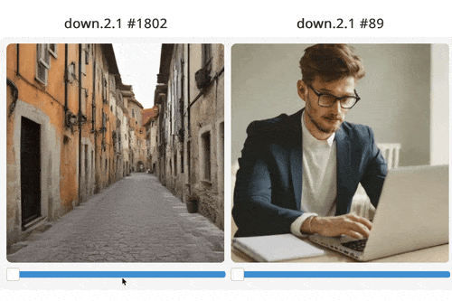
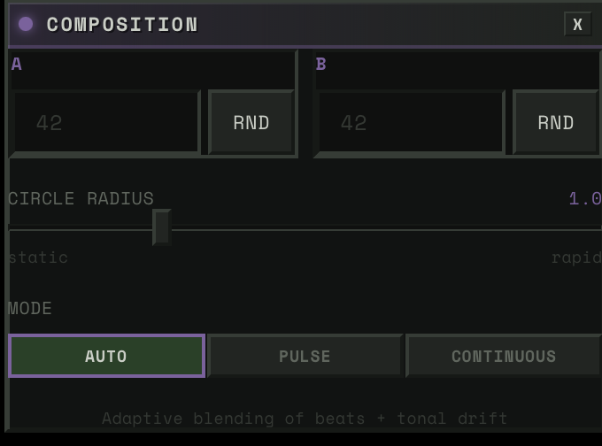

  <iframe src="https://www.youtube.com/embed/g_y9-ogzzao" frameborder="0" allowfullscreen style="position: absolute; top: 0; left: 0; width: 100%; height: 100%;" />

*See also: [teaser video](https://youtu.be/OOtSUKUOLHM)*

---

Computers used to dance.

If you were around for Winamp, you remember. You'd put on a song, fullscreen the visualizer, and just watch. Something about seeing your speakers' output rendered as motion made the listening experience more vivid. Like the music had a body.

Then streaming happened, and the dancing stopped. Spotify gives you a looping clip. Apple Music gives you an animated album cover. The visualizer just... isn't part of the software anymore.

And then TikTok turned music into a vehicle for short-form content — the visual leads you _to_ the audio, not _with_ it.

Oops.

## Why music visualization matters

Music appreciation is a funny thing. We all have the wiring for it, but whether you actually enjoy a song depends almost entirely on how familiar you are with it.

I remember the first time I listened to amapiano. I said to myself — what the hell is up with this constant drum loop. It's the same stuff over and over. But I kept listening. On like the 5th play of this one track, I got it. Amapiano is defined by the buildup — the trance-like drums, how they layer and resolve. The repetitiveness is *needed* for tension. It is a feature, not a bug. The issue was just not being aware that tension was building, that things were becoming layered, that patterns were playing.

Turns out [there's research on this](https://doi.org/10.3389/fnins.2017.00147): familiarity is the single strongest predictor of whether someone likes a piece of music. Not complexity, not genre, not instrumentation. Just: have you heard something like this before?

And I know I'm not the only one who does this: listening to the same song over and over, focusing on different stems each time. An instrument, a harmony, a texture you didn't notice before. Once you know what to expect, you start hunting for the most satisfying parts with your ears. But why not with your eyes?

There's been too many times when I'm listening to a song and I say "wait this is the best part" and then no one knows what I'm talking about.

Visuals can bridge that gap. If you can *see* the patterns, see the tension building, see the stems layering, you get acquainted with the music faster. Time to enjoyment goes down.

The closest thing we have to music visuals right now is TikTok dances. And I love them. They're dynamic, they let people physically express their favorite moments in a song. But they only work for music that's already mainstream. Creators make money dancing to songs that reach the most people, which pushes the industry toward formulaic structure, earworm hooks, and short runtimes. It's music visualization optimized for engagement, not appreciation.

When's the last time you saw a TikTok dance to Mongolian throat singing? Tbh when's the last time you even saw a music visualization?

We gotta bring back algorithmic music vis for this era. Algorithmic in the sense of digital signal processing, not algorithmic in terms of social media engagement.

---

## The Space Behind the Image

I came into machine learning through data visualization.

Back when everyone was talking about "big data," I thought — what the hell do I gain from scrubbing through 20 gigs of rows? A few numbers? But then I took a data vis class and it clicked. With good visualization, you could make sense of datasets that were way too big to reason about manually. You could show people what was actually going on in their systems — patterns that were there the whole time but nobody could see without the right tool. Data vis made it so you didn't need to be an analyst to understand what the data was saying.

That idea stuck with me as the models got bigger. With convolutional neural networks, you could visualize feature maps: actual images of what each layer had learned. Edges in early layers. Textures in the middle. Faces near the end.

*CNN feature visualization, from [The World Through the Eyes of CNN](https://medium.com/analytics-vidhya/the-world-through-the-eyes-of-cnn-5a52c034dbeb)*

Researchers have always been trying to see what's inside. Feature maps. Saliency maps. Attention visualizations. Latent interpolations. The tools exist. But they live in Jupyter notebooks and research papers. Built by ML people, for ML people. Your average person has no way in.

Deep Dream was the exception. In 2015, Google showed the world what neural networks had learned. Those trippy dog-slug chimeras and fractal eyeballs. Millions of people got an intuition for what was happening inside these models.

That was a decade ago. Models have gotten way more powerful since then, and way more used. Everyone interacts with generative AI now. But the tools to see what's inside haven't kept up. Interpretability research is thriving, but it's still a field talking to itself. We need data vis for generative models. Tools that let people actually see what these things learned.

---

## The Medium, Not the Copy

Almost everyone using image generation is trying to replicate. Ghiblify yourself. Replace a stock photo. Generate a headshot so you don't have to pay a photographer. The entire conversation is replacement.

But a model trained on millions of images doesn't just learn to produce images. It learns patterns. It builds a structured space where visual concepts are organized — by mood, by composition, by texture. "Intensity" lives somewhere in there. "Warmth" lives somewhere else. "Tiger stripes" and "leopard spots" are neighbors. We have this entire space to explore and we're riding the same train through it every time — type a prompt, get an image, done.

So how do you actually get in there?

Sparse Autoencoders decompose a model's activations into interpretable features — actual concepts, not mysterious dimensions. [Surkov et al. at EPFL](https://sdxl-unbox.epfl.ch) trained SAEs on SDXL-Turbo and found 20,480 features across four attention blocks. The features weren't labeled, so we [labeled all 20,480 ourselves](https://huggingface.co/datasets/hammamiomar/sdxl-turbo-sae-labels) using a VLM ensemble for $85. Feature 2301 makes images "intense and dark." Feature 4977 adds "tiger stripes." Feature 4161 makes people smile.

*SAE feature steering, from [sdxl-unbox.epfl.ch](https://sdxl-unbox.epfl.ch)*

It's worth saying — SAEs aren't definitive. One feature plus another can produce something completely unrelated to either. The decomposition gives you footholds, not ground truth. Think of it as a compass for the space inside the model — it points you in directions, and some of those directions produce genuinely cool interactions, but nobody's claiming we've fully mapped what's in there. It's a tool, and right now it's one of the best we have for steering generation through concepts instead of just prompts.

(For more on SAE feature exploration, see Sangwu Lee's [Gazing in the Latent Space](https://re-n-y.github.io/devlog/rambling/sae/), and tools like [fluxlens](https://fluxlens.vercel.app/) and Gytis's [Feature Lab](https://www.featurelab.xyz/) for browsing them interactively.)

---

## Making the Model Dance

I built a tool to navigate that space, with music as the interface.

You upload a song. The system separates it into stems — bass, drums, vocals, and everything else — then runs offline analysis on each one: where the beats fall, how the energy moves, what the pitch is doing, how much tension the harmony carries. All the expensive DSP happens once at upload. At runtime, it's just looking up pre-computed values.

Then you set up the stage.

First, the noise space. Every generated image starts from noise — and different noise produces different variations of the same prompt. You've probably noticed this if you've ever generated the same prompt twice and gotten different results. We use that space for the song's structure. For rhythmic music, the noise walks in a circle synced to the beat. For ambient tracks, it drifts continuously — and the system switches between modes automatically based on the song's structure. You control how wide the circle is — bigger means more dramatic shifts, smaller means subtle.

Then, the prompt space. You define two prompts — say, "cat" and "dog." Then you connect that space to a stem. Say you wire it to a violin. As the violin's pitch swings up, the image shifts toward dog. As it swings down, back toward cat. But you can connect it to anything. Wire it to the drums instead, and the image snaps toward dog on every hit, then relaxes back to cat on release.

Then, the SAE blocks. Four of them, each controlling a different aspect of the image — composition, structure, detail, texture. Each block has around 5,000 features to choose from. You connect a block to a stem and pick a concept. Say you wire the bass to "warmth." When the bass hits hard, the image floods with warmth. When it pulls back, the warmth fades. Wire the drums to "intensity" and every kick punches the image darker.

*Each block connects a stem to a feature — pick the stem, pick the concept, adjust the strength.*

Hit play and it's all running at 50 frames per second. And everything is live. You want to swap a feature, it changes instantly. Reassign a stem, instant. Adjust the weight of a connection, instant. You're not setting up a render and waiting. You're performing.

Each element of the song gets its own stage on the canvas. If you're listening and you want to focus on the keys, make that the dominant connection and the image dances to them. Swap to drums and the whole feel changes. The same song, with different choices, is a completely different experience every time.

---

## The Character

If I'm gonna have a visualizer running on my computer, I don't want it to be a waste of space. You always need someone there. No more rubber ducky — meet hambajuba.

He's a little dopey terminal who loves to feel the music. His eyes blink on the beat, flowers grow inside him, and the image generation lives in his chest like a heart.

Winamp had skins. I want hambajuba to be like that — something you make yours.

---

## Where This Goes

Right now the project is built around SDXL-Turbo, but the architecture doesn't care what generates the image. Flux, video diffusion, whatever runs fast enough and has interpretable internals — we can steer it.

The direction I'm most excited about is representation models. DINOv2, SigLIP, SAM2 — these models learn how to see. Not how to generate images, but how to understand them — objects, spatial relationships, abstraction levels. And recent work (REPA, RAE, FAE) is showing you can generate images directly in a representation model's feature space. No VAE, no pixel space. The representation becomes the generation space.

If we could steer through that, we wouldn't just be navigating SAE features in a diffusion model. We'd be navigating how a vision model understands the visual world. Data vis for that. That's where I want this to go.

Music visualization is the first application because music gives you a continuous signal that maps well onto generation. But the tool is really about making interpretability fun and accessible. Not just for ML researchers, but for anyone curious about what's inside these models.

---

## Credits

This project builds on work from the interpretability and real-time generation communities:

- **[Surkov et al. — Interpreting and Steering Features in Images](https://sdxl-unbox.epfl.ch)** (EPFL, NeurIPS 2025) — The SAE training on SDXL-Turbo that makes steering possible. The foundation this project is built on.
- **[Goodfire: Painting with Concepts](https://www.goodfire.ai/research/painting-with-concepts)** — The insight that SAE features can be spatially painted onto generation at 16x16 resolution. Our spatial mask system builds directly on this.
- **Gytis Daujotas — [Feature Lab](https://www.featurelab.xyz/)** — Interactive SAE feature explorer. ([Interpreting and Steering Features in Images](https://www.lesswrong.com/posts/Quqekpvx8BGMMcaem/interpreting-and-steering-features-in-images))
- **Sangwu Lee — [Gazing in the Latent Space with Sparse Autoencoders](https://re-n-y.github.io/devlog/rambling/sae/)** and **[fluxlens](https://fluxlens.vercel.app/)** — SAE feature exploration and interactive browsing tool.
- **[StreamDiffusion v2](https://streamdiffusionv2.github.io)** — Real-time diffusion pipeline techniques. Their stream batch and residual CFG work informed early architecture decisions.
- **[Overworld Engine](https://github.com/Overworldai/world_engine)** — Related work in real-time interactive generation.
- **[R4G: Representation for Generation](https://kdidi.netlify.app/blog/ml/2025-12-31-r4g/)** — Survey of how representation models and generative models are converging.
- **[Our labels for all 20,480 features](https://huggingface.co/datasets/hammamiomar/sdxl-turbo-sae-labels)** — VLM ensemble labeling across all 4 blocks, published on HuggingFace.

---

_For the full engineering deep dive — how we hit 50 FPS, how SAE steering works inline, how the audio bridge is built — read [the technical writeup](/blog/fifty-fps-realtime-sdxl)._
