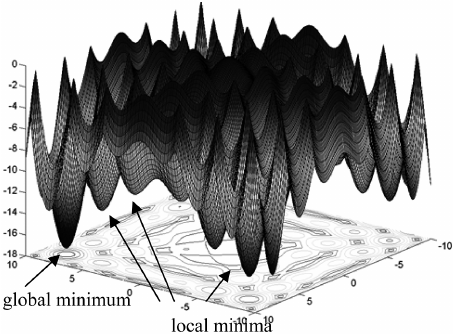
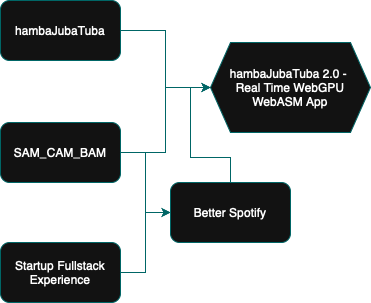

At the end of a Recurse Center batch, its expected to write a “Return Statement”— signaling the end of a recursion. A reflection of sorts, a closing end to signify the end of the batch. Get ready, I'm about to dump on you all— chronologically.

---

# Timeline

## Before Recurse

I joined the Recurse Center due to a need of fresh air in my post grad life. I graduated May 2024 from NYU with my masters, grinding away on anything and everything ML— kaggle competitions, textbooks, personal projects, etc. Whilst I did my own self-directed work, I oftentimes felt pigeonholed, working alone and sharing my work with friends who didn't really understand what I was doing. Everything was in the aim of making myself a stronger ML engineer, as I was looking for a job. Even though I was working alone, I felt good— being able to work and research your own interests is true freedom.

But the 2024 job market was not my friend. As the months went by, job listings declined. By the start of 2025, the solitary work and lack of progress in job searches got to me. It must be understood that my main focuses were landing a job, and continuously learning and producing good work. However when progress is felt to stagnate in one focus, it can start to affect the overall vision and focus in oneself. I needed a change. 

My friend recommended me the Recurse Center— I applied, and got accepted. Then it all started.

## Month 1 

At the beginning of month 1, we were told to write out our goals of the batch. Coming from my own months of self-driven work, I wanted to continue forcefully on my prior work: [hambaJubaTuba](https://github.com/hammamiomar/hambaJubaTuba), a diffusion based music visualizer. The improvements of the project were indeed at the edge of my abilities: I wanted to achieve realtime visualization through separating the project from my use of HuggingFace pipelines, and also wanted to explore audio tokenization, imagining direct music to image generation ( as the prior work was audio interpolating text prompts and latent noise). 

So for the first month, I worked on researching the current state of audio tokenization, implementing CLAP with different weights focused on music, into my prior work. As the end of the month neared, I had a working solution— but since most audio tokenization is trained to classify speech and sound effects, I had difficulty in producing a similar result to my prior implementation. The audio tokenization methods were not nearly as informational, in a music visualization lens. 

I took a step back. Why am I still pigeonholing myself? I looked at what other people were doing, and for one week decided to join a friend in his Rust learning. I found the language very satisfactory, as many of the design choices in the language made a lot of sense to me. 

So this was kind of a pivoting moment. In this moment, I encompassed all three of the RC self directives. 

1. Work at the edge of my abilities
    * Rust was a language that I've always had interest in, but never thought that I would be able to dig deep and push to learn it. I loved writing C++ in the past, so I was still familiar with systems programming— but Rust is notorious for its learning curve. These combined factors proved it to be a very good edge of my ability— something new, but not so far beyond. 

2. Build your volitional muscles
    * Building your volitional muscles is described as building “your ability to make decisions about your work and learning based on your own curiosity and joy, rather than external pressures and fears.” Prior to RC, all of my work was done due to the external pressure of remaining in ML, focusing solely on ML work. I didn't want to venture out and work on things that wouldn’t help me in the pressure of getting a full time ML job— it felt counterintuitive. 
    * However, what I didn't know at the time was that I WAS already exercising my volitional muscles in my prior work— just not to its full extent. hambaJubaTuba was a project that was largely focused on speed and optimization, where my prior work in ML was more data science/modeling. By learning Rust, I would be able to extend my ability in writing fast code, following my natural curiosity that had been present before. I really wanted to write fast low level code prior to RC, but didn't feel like it would be appropriate to make such a vast jump!

3. Learn Generously
    * Learning generously is when you learn and share as you learn, allowing the community to uplift itself as a whole. By learning Rust I would be able to join the people who were also on the same path, no longer doing solitary work.

I was happy. I started to consume the Rust book, and started writing rust code. 

## Month 2

This month was the core “learning rust” month. It was also Ramadan, so I had to push through my work with no food or liquids during the day. No caffeine hurt my productivity a lot, as well as the inability to work into the night, as I needed to break fast and focus on my religious values. 

But I got a lot done. I learnt egui, and produced a simple audio visualizer in Rust. After that, I completed a more guided project— [PNGme](https://jrdngr.github.io/pngme_book/), an intermediate CLI program that lets you hide secret messages in the PNG file header. That was a lot of fun, and the small guidance was very helpful, ensuring completion of code with given unit tests rather than just vibes and hope. I also kept reading chapters of the rust book as time went on. 

After this work, I felt confident enough to tackle a project I had been thinking about for a while : [SAM_CAM_BAM](https://github.com/hammamiomar/SAM_CAM_BAM). The name is described as follows : Segment Anything Model - Camera -BAM ! (Musical note). The idea was to utilize an image segmentation model to segment the users webcam, and produce live music visualization on top of the image masks, giving an interactive, dancing, mosaic like visualization. 

Getting the webcam to work was very difficult— rust crates are often not stable. On this project, I learned a lot in reading through source code, forums, and patching the crates— as LLM knowledge cutoffs offer little support for new crates. By the end of the month, I had a working webcam stream in egui, and the ability to draw masks on the camera with an ONNX model. I had also finished reading the rust book (some chapters multiple times over). Yay!

## Month 3

During this month, I pushed my volitional muscles more. Through Recurse Center networking, I found myself joining a startup, working part time. No, this is not recommended— unless all the stars align. And for me, it did.

Let me explain. I had minimal frontend/fullstack experience before RC— only in my undergrad half-baked projects. I saw this opportunity to expand my learning, as I really wanted to just see how startups work in producing full stack apps; how is deployment done, how are iterations created, how can a frontend work so beautifully. The only frontend I had done prior to this was gradio, basic Astro templates, and just straight up HTML/CS/JS! This opportunity was perfect for me. 

So while I worked on implementing voice fingerprinting at the startup, I continued working on SAM_CAM_BAM. I got it to a point where I was producing visualizations corresponding with music, and felt very happy.

Halfway through the month, I started working on a new project— [Betterd_Spotify](https://github.com/hammamiomar/betterd_spotify). Built in Dioxus, a react-like rust web framework, I created a web app that for now, offers the user the ability to truly shuffle their large playlists. I don't know if you ever have that issue, but whenever I shuffle my 6,000 song playlist that Ive been curating since 2015, anytime I shuffle I’m given songs that Spotify THINKS I like, and even when I shuffle in a new session it's still the same segment of songs. 

I never would have thought I would be building a react like frontend with a comprehensive split server/client architecture, nevertheless in rust. But my experience during this month allowed me to get to this point. 

Near the end of the batch I presented SAM_CAM_BAM during demo day, and felt very accomplished and happy. I had a very nice conclusion to my batch.

---
# Brain Change

## Graph traversal and gradient descent

From a chronological point of view, it seems like I was just doing what I wanted. It sounds easy, right? WRONG. Picking out what you want to work on, is half the battle at the RC. You hear it all around you— people oftentimes spending weeks trying to decide what they want to do. Throughout my time at the RC, I learned how to unravel the way I think about progression, and achievement. 

I read some books written by wonderful computer scientists to assist me in this mental unraveling. I will write of them now. 

### *The Art of Doing Science and Engineering: Learning to Learn* by Richard Hamming

Hammings main message is your personal style of work and thinking, rather than pure knowledge, will take you to the places that you want to go. You must have the volition to approach difficult topics that you think will have an affect on the future, whilst also being aware of the multi-pathed way that it might take to get there. The path to great things is uncertain and messy, but Hamming lets it be known that through a thorough and an exceeding work habit, you can maintain a path towards your own personal greatness. 

It doesn't meant that you have to constantly push yourself and drive yourself crazy. It means that you have to be comfortable with uncertain learning, being aware of your weaknesses, compensating for them. It means that you should strive to improve yourself everyday, as knowledge and experience compounds itself. It means you can have both broad visionary goals and stable pathway goals. You must be aware of yourself, your position, and your future. 

Another important element is the idea of doing things and learning in the right manner. It's important to learn fundamentals and dig deep into what you are learning, as technology changes, but is still rooted in the same fundamentals. It means you have to actively be aware that the time and effort of learning fundamentals **now** might not prove fruitful, but can unlock a path in your future work. 

He also speaks of communication being crucial, as the ability to sell your ideas is how it can progress itself. Without the ability to share your ideas, they will not live to tell the tale.

### *Why Greatness Cannot Be Planned: The Myth of the Objective* by Joel Lehman and Kenneth Stanely

The key insight: achievement comes through exploring many paths, not optimizing a single metric. The inventors of vacuum tubes weren't trying to build computers. The physicists studying quantum mechanics weren't trying to invent the laser— they were just trying to understand how atoms work. If you gave someone a petri dish and told them to create intelligent life, would they breed for intelligence? No— they'd optimize for survival and let emergence handle the rest.

There’s also an interesting parallel in deep learning— escaping a local minima. If an algorithm is solely focused on improving their loss function based on the objective, it can get stuck at the bottom of a gradient valley, as it takes small measurable steps to achieve their goal. However, thats not the best it can do! Instead, the algorithm must explore all possible minimas, and not be afraid to jump out of its comfortable minima valley, as it can jump to an even better minima. You have to explore all paths, and not tunnel vision on a certain “measures” of progress!

  Source: <a href="https://www.researchgate.net/figure/Trapping-of-local-minima_fig1_228897790">ResearchGate</a>

Given these thought examples, they recommend the idea of working as a stepping stone collector. You should follow your gut and interests, jumping from stepping stone to stepping stone. Because eventually, one stepping stone may lead you to make the broad jump to a great achievement— something that you would’ve never known if you had never jumped down that stone path.

But here's the nuance the book taught me: you still need to dive deep into each path you explore. It's not about half-assing a bunch of things— it's about fully committing to each local minima while staying open to jumping to new ones. When I was learning Rust, I wasn't doing it halfheartedly because "maybe it'll help with ML somehow." I went all in, reading the entire Rust book, wrestling with the borrow checker, building complete projects. You have to earn the insights that each stepping stone offers.

The balance is this: globally, you're a stepping stone collector, ready to jump to unexpected paths. But locally, you're still pushing hard, working at the edge of your abilities, trying to master each stone you land on. That's how you build the skills and insights that reveal the next stones. My deep dive into Rust's performance characteristics is what made me realize I could tackle the diffusion visualizer differently. If I'd just dabbled, I'd never have seen that connection.

Yes, it's okay to have broad visions. But you have to be wary in tunnel visioning and trying to achieve that vision following a false compass. 

### The Beautiful Paradox: Structured Exploration

At first glance, Hamming and Stanley/Lehman seem to be in tension. Hamming talks about excellence, deliberate practice, and having vision. Stanley and Lehman warn against objectives and tell you to collect stepping stones. But living through RC, I realized they're describing the same truth from different angles.

Both books agree: **premature precision kills innovation**. Hamming says have visionary goals but keep them open-ended. Stanley/Lehman say forget the objective and follow interesting paths. They're both right— you need the North Star of "I want to build something meaningful" without the GPS route of "I must take exactly these steps."

The real insight is about **committed exploration**. You must be consistent and excellent (Hamming) while jumping between stepping stones (Stanley/Lehman). It's not wandering aimlessly OR grinding single-mindedly. It's grinding hard on whatever stone you're currently on, while staying alert for unexpected connections to other stones.

Both emphasize **cultivating diverse ideas**— Hamming through learning fundamentals deeply, Stanley/Lehman through collecting varied experiences. Why? Because innovation happens at intersections. My Rust knowledge intersecting with my ML background opened possibilities neither skill alone could access.

Most importantly, both books teach **intellectual flexibility**. Whether you call it "reframing the problem" (Hamming) or "changing the objective" (Stanley/Lehman), it's the same skill: holding your goals lightly enough to evolve them when reality teaches you something new.

This is exactly what RC's directives encode:
- **Work at the edge of your abilities** = Hamming's excellence + finding the right stepping stone
- **Build volitional muscles** = Stanley/Lehman's exploration + Hamming's self-directed vision  
- **Learn generously** = Both books' emphasis on communication and shared discovery

RC didn't just give me a place to code. It gave me a philosophy that unifies seeming contradictions: be excellent AND exploratory, be focused AND flexible, be driven AND open. That's not a paradox— that's the algorithm for growth.

  My stepping stones, showing a new stone to jump to

## Working in the public eye

Beyond the technical and philosophical shifts, RC challenged me on a deeply personal level. I've always been a shy person. In university and school I, always got away with hiding away, doing my work as I should, and letting myself not face the discomfort of perception. But at RC, I witnessed my mind shift away from this behavior.

This connects directly to what both books emphasize about communication. Hamming dedicates entire chapters to selling your ideas— "the ability to communicate is crucial, as the ability to sell your ideas is how it can progress itself." Stanley and Lehman talk about how stepping stones only become paths when they're shared— your discoveries might be exactly what someone else needs to make their next jump.

People WANT to know what you are doing. If you aren't sharing, it's almost a selfish act— inherently saying that work at your level is not worth sharing. But more than that, you're cutting yourself off from the network effects of learning generously. Every time I finally forced myself to share, someone would point out a connection I hadn't seen, a tool I didn't know about, a different angle on the problem.

Yes, it's scary to be perceived. But in talking to some folk whose voices are the loudest, you realize that they are afraid too, but they know that it's something they have to do. It's another form of working at the edge of your abilities— not technical edges, but personal ones.

When I forced myself to share (albeit, at the end), it felt really nice. People were genuinely interested and wanted to know more. I only wish I stressed this to myself earlier. The volitional muscles aren't just about choosing what to work on— they're about choosing to be visible, to contribute to the collective exploration.

I guess it's time to make a public Twitter account.

---
# Closing thoughts 

The Recurse Center was a very deep pivotal point for me. Fresh out of school,I had yet to feel truly comfortable in my ability to do things without structure. In school, you are given consistent progression and progression trackers, towards the goal of graduation. 

But real life doesn’t have that structure, and thats something to be embraced. 
As I entered the RC, I thought progress meant following a straight line— ML job, ML projects, ML everything. But the directives and those books taught me the same truth: the path to greatness isn't linear, it's exploratory.

Working at the edge of your abilities, building volitional muscles, learning generously— these aren't just nice principles. They're a complete reframing of how to grow. You collect stepping stones, jump between interests, share as you go. My path from audio tokenization to Rust to full-stack wasn't a detour; it was THE path. Each stone revealed new stones I couldn't see before.

Uncertainty isn't something to overcome— it's the medium we work in. Like escaping local minima, real learning requires being comfortable not knowing exactly where you're headed. You just trust that following curiosity and sharing what you find will take you somewhere more interesting than any objective-driven path could. RC gave me a new operating system for how to learn, build, and grow. And that's the real recursion— each cycle through these principles reveals new depths, new edges, new muscles, new knowledge to share.

Thank you.
