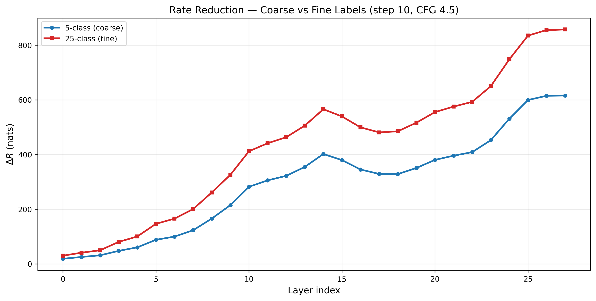
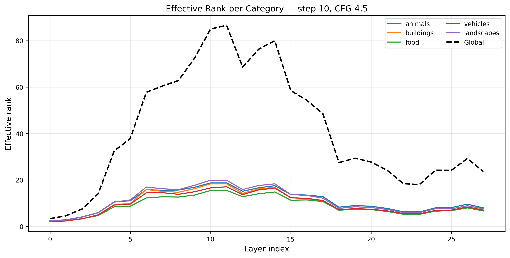
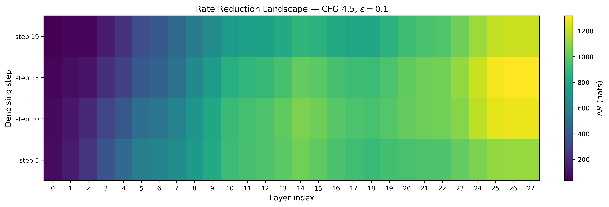
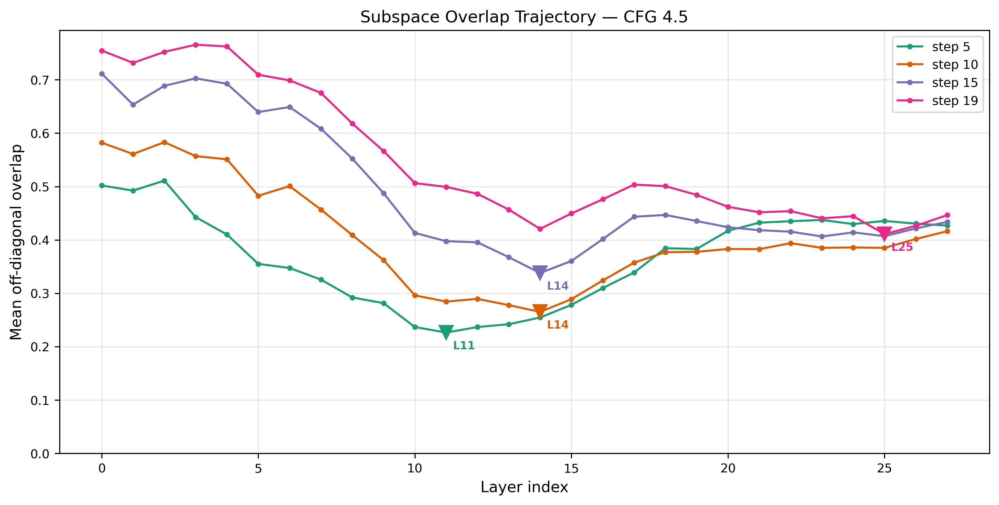
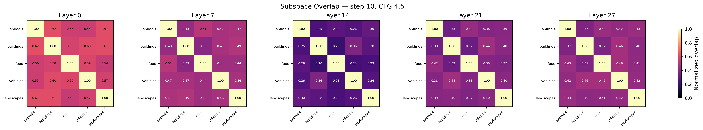
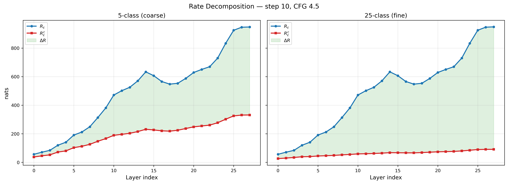
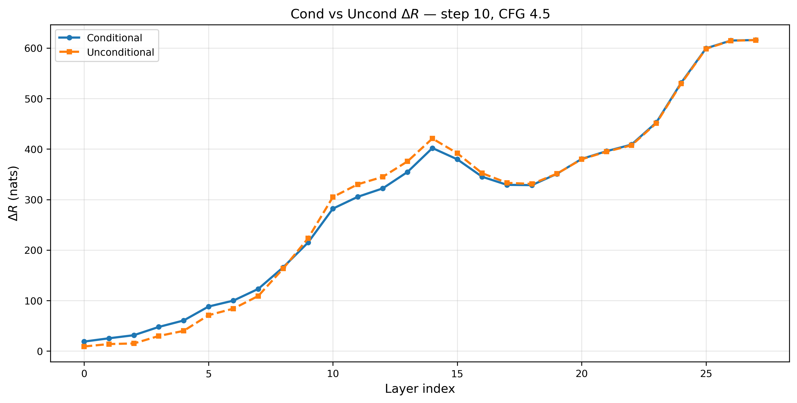
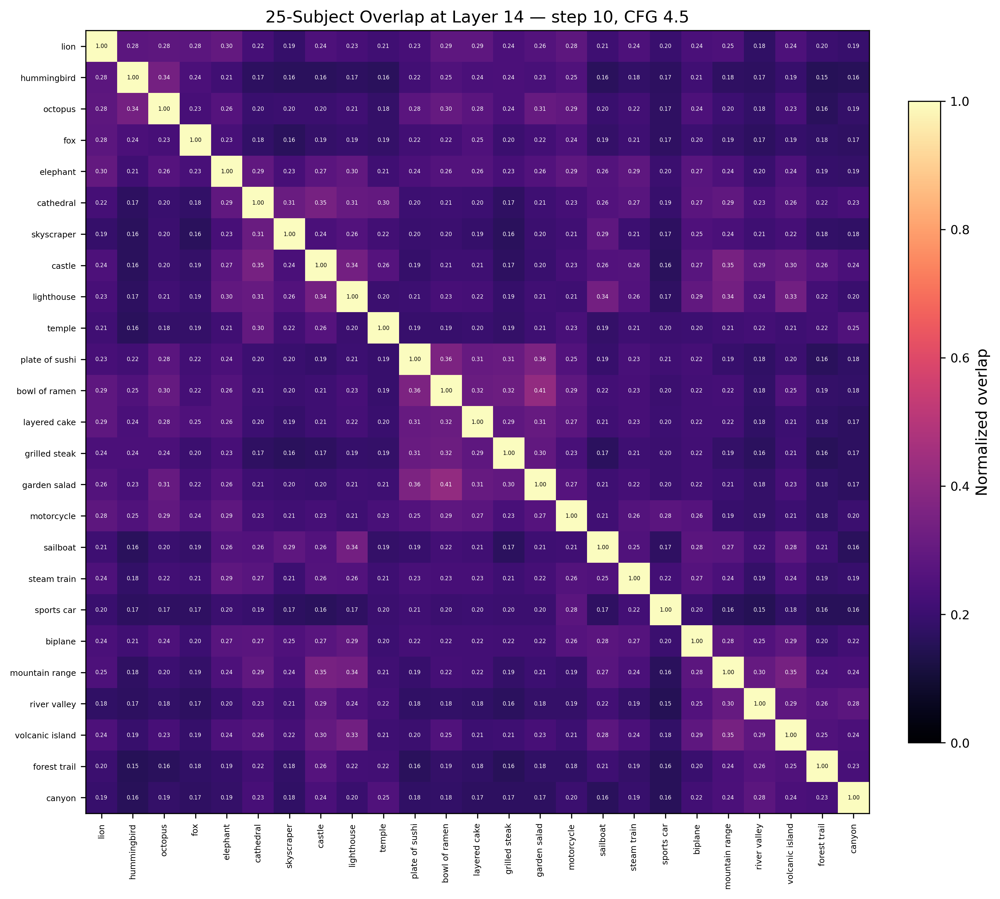

[GitHub →](https://github.com/hammamiomar/SubspaceLens)

## The Question

Last month I built a [real-time music visualizer](/blog/letting-computers-dance) that steers SDXL-Turbo at 50 FPS by clamping Sparse Autoencoder features — 20,480 dictionary atoms, each supposedly one visual concept. It worked. But the whole time I had this nagging feeling: *is this actually how the model organizes information?*

SAEs assume activations are **sparse** — each input decomposes into a handful of active atoms from a big dictionary. But there's growing evidence that transformers actually learn *factored representations* — different concepts occupy orthogonal subspaces, and within each subspace, the representations are **dense, not sparse** ([Shai et al., 2026](https://arxiv.org/abs/2602.02385)). If that's true, a sparse dictionary might not be the right lens for understanding these models.

So I went looking for a different framework. I found it in [*Principles and Practice of Deep Representation Learning*](https://ma-lab-berkeley.github.io/deep-representation-learning-book/index.html) from the Ma group at Berkeley.

---

## Why Not SAEs?

SAEs learn an **overcomplete dictionary** — 8× or 16× more atoms than dimensions — and decompose each activation into a sparse combination of them. MCR² asks a different question entirely. Instead of "which dictionary atoms are active?" it asks "how much representational volume does each concept occupy, and are the concept subspaces orthogonal?"

These are complementary lenses, not competitors. SAEs decompose into sparse features; MCR² measures subspace geometry. Both could be capturing real structure.

Both approaches require running images through the model to collect activations. The difference is what happens next. [TIDE](https://arxiv.org/abs/2503.07050) trains a separate SAE on each layer's activations — hours of GPU compute on 80K images per layer. SubspaceLens computes eigendecompositions of covariance matrices — seconds of CPU on 500 images. No learned parameters, no reconstruction loss to tune, no sparsity hyperparameter to sweep — though it does have its own hyperparameters (coding precision ε, subspace rank) that affect the results.

| | TIDE (SAE) | SubspaceLens (MCR²) |
|---|---|---|
| **Inference** | 80K images through PixArt | 500 images through PixArt |
| **Post-inference** | Train SAE per layer (hours) | Eigendecomposition per layer (seconds) |
| **Assumption** | 5% sparsity | Low-dim subspaces (can be dense) |
| **Model** | PixArt-α, 28 layers | PixArt-α, 28 layers |

---

## The Math

### Coding Rate and Rate Reduction

The book's argument: a deep network *can* transform data into a union of low-dimensional linear subspaces, one per concept — and the book constructs specific architectures (ReduNet, CRATE) that do this by design. Whether a network trained with a *different* objective (like denoising) also produces this structure is an open question. You measure how close a representation is to this ideal with the **coding rate** — how many bits you'd need to encode a set of vectors under a Gaussian codebook at precision $\varepsilon$:

$$R_\varepsilon(\mathbf{Z}) = \frac{1}{2} \log \det\left(\mathbf{I}_d + \frac{d}{N\varepsilon^2} \mathbf{Z}\mathbf{Z}^\top\right)$$

where:

- $\mathbf{Z} \in \mathbb{R}^{d \times N}$ — the representation matrix. Each column is one activation vector. Here $d = 1152$ (PixArt-α hidden dimension) and $N = 500$ (number of images).
- $\mathbf{I}_d \in \mathbb{R}^{d \times d}$ — the identity matrix.
- $\varepsilon > 0$ — the coding precision. How accurately we encode each vector.
- $\mathbf{Z}\mathbf{Z}^\top \in \mathbb{R}^{d \times d}$ — the unnormalized sample covariance.
- The $\log\det$ measures the log-volume of the ellipsoid spanned by the data relative to $\varepsilon$-balls — more volume, more bits needed.

This is the *Gaussian* coding rate — exact when data is Gaussian, an upper bound otherwise. The true rate-distortion function for arbitrary distributions is intractable. The Gaussian version is the one used throughout the MCR² literature because it's closed-form and its gradient decomposes cleanly into expansion and compression operators.

In practice, we use **Sylvester's determinant identity** to make this cheaper:

$$\det\!\left(\mathbf{I}_d + \mathbf{Z}\mathbf{Z}^\top\right) = \det\!\left(\mathbf{I}_N + \mathbf{Z}^\top\mathbf{Z}\right)$$

This lets us compute the $N \times N$ Gram matrix $\mathbf{Z}^\top\mathbf{Z}$ ($500 \times 500$) instead of the $d \times d$ covariance $\mathbf{Z}\mathbf{Z}^\top$ ($1152 \times 1152$). Same value, cheaper.

Compute the coding rate twice: once for everything together ($R_\varepsilon$), once per class averaged ($R_\varepsilon^c$). The difference is **rate reduction**:

$$\Delta R = R_\varepsilon(\mathbf{Z}) - R_\varepsilon^c(\mathbf{Z} \mid \Pi)$$

where:

- $R_\varepsilon^c(\mathbf{Z} \mid \Pi) = \sum_{k=1}^{K} \frac{N_k}{N} \, R_\varepsilon(\mathbf{Z}_k)$ — the weighted average coding rate when representations are partitioned by class membership $\Pi$.
- $\mathbf{Z}_k \in \mathbb{R}^{d \times N_k}$ — the $N_k$ columns of $\mathbf{Z}$ belonging to class $k$.
- $K$ — the number of classes. 5 for our coarse grouping (animals, buildings, food, vehicles, landscapes), or 25 for fine (lion, cathedral, sushi, …).

High $\Delta R$ = globally spread out, locally compact. That's what orthogonal subspaces look like.

---

### From Rate Reduction to Transformer Layers

The gradient of $\Delta R$ with respect to $\mathbf{Z}$ decomposes into an expansion term and a compression term:

$$\frac{\partial \Delta R_\varepsilon}{\partial \mathbf{Z}}(\mathbf{Z}^\ell) = \mathbf{E}^\ell \, \mathbf{Z}^\ell \;-\; \sum_{k=1}^{K} \gamma_k \, \mathbf{C}_k^\ell \, \mathbf{Z}^\ell \, \mathbf{\Pi}_k$$

The **expansion** operator $\mathbf{E}^\ell \in \mathbb{R}^{d \times d}$ increases the overall coding rate — it pushes classes apart:

$$\mathbf{E}^\ell = \alpha\left(\mathbf{I}_d + \alpha \, \mathbf{Z}^\ell (\mathbf{Z}^\ell)^\top\right)^{-1}$$

The **compression** operator $\mathbf{C}_k^\ell \in \mathbb{R}^{d \times d}$ decreases the within-class coding rate — it pulls each class tight:

$$\mathbf{C}_k^\ell = \alpha_k\left(\mathbf{I}_d + \alpha_k \, \mathbf{Z}^\ell \, \mathbf{\Pi}_k \, (\mathbf{Z}^\ell)^\top\right)^{-1}$$

where $\alpha = d/(N\varepsilon^2)$, $\;\alpha_k = d/(N_k\varepsilon^2)$, $\;\gamma_k = N_k/N$, and $\mathbf{\Pi}_k \in \mathbb{R}^{N \times N}$ is a diagonal matrix encoding membership in class $k$.

In the book's white-box architectures (ReduNet, CRATE), each layer is *constructed* to perform one step of projected gradient ascent on $\Delta R$:

$$\mathbf{z}^{\ell+1} = \mathbf{z}^\ell + \eta\left(\mathbf{E}^\ell \, \mathbf{z}^\ell \;-\; \sum_{k=1}^{K} \gamma_k \, \mathbf{C}_k^\ell \, \mathbf{z}^\ell\right)$$

where $\eta > 0$ is the step size and $\mathbf{z}^\ell \in \mathbb{R}^{d}$ is a single token's representation at layer $\ell$.

This is proven for architectures designed to optimize $\Delta R$, not for arbitrary transformers. The book explicitly notes it remains "unclear why any chosen 'black-box' network is able to optimize the desired MCR² objective at all." Whether PixArt — trained with a denoising loss, not MCR² — performs something similar is the hypothesis I'm testing, not an established result.

---

### The Denoising–Rate Reduction Connection

Here's what made me want to test this. Decompose the covariance as $\mathbf{Z}^\ell (\mathbf{Z}^\ell)^\top = \mathbf{U}^\ell \, \mathbf{\Lambda}^\ell \, (\mathbf{U}^\ell)^\top$, where $\mathbf{U}^\ell \in \mathbb{R}^{d \times d}$ is orthogonal and $\mathbf{\Lambda}^\ell = \operatorname{diag}(\lambda_1^\ell, \ldots, \lambda_d^\ell)$ contains the eigenvalues. Then the expansion operator becomes:

$$\mathbf{E}^\ell = \alpha \, \mathbf{U}^\ell \, \operatorname{diag}\!\left(\frac{1}{1 + \alpha\lambda_1^\ell},\; \ldots,\; \frac{1}{1 + \alpha\lambda_d^\ell}\right) (\mathbf{U}^\ell)^\top$$

It shrinks high-variance directions (large $\lambda_i$) and preserves low-variance ones.

Compare with the Bayes optimal denoiser for a Gaussian $\mathbf{x} \sim \mathcal{N}(\boldsymbol{\mu}, \boldsymbol{\Sigma})$ with $\boldsymbol{\Sigma} = \mathbf{V}\operatorname{diag}(\lambda_1, \ldots, \lambda_d)\mathbf{V}^\top$ at noise level $t$:

$$\bar{\mathbf{x}}^*(t, \mathbf{x}_t) = \boldsymbol{\mu} + \mathbf{V}\,\operatorname{diag}\!\left(\frac{\lambda_1}{\lambda_1 + t^2},\; \ldots,\; \frac{\lambda_d}{\lambda_d + t^2}\right) \mathbf{V}^\top(\mathbf{x}_t - \boldsymbol{\mu})$$

Both are eigenvalue-dependent contractions governed by the same matrix inverse structure $(\mathbf{I} + c \cdot \text{covariance})^{-1}$. The Ma group calls this a "deep link" — the structural correspondence is exact **under the Gaussian mixture assumption**. For natural images, this is a modeling approximation (GMMs can approximate arbitrary distributions, but the coding rate formula is only tight for Gaussian sources). The connection is rigorous in the GMM regime and motivating elsewhere.

If this link extends to a diffusion transformer trained on natural images, it predicts that denoising layers should progressively increase $\Delta R$ — separating concepts into subspaces as a byproduct of removing noise. That's a testable prediction.

To my knowledge, no one has applied MCR² coding rate metrics to diffusion transformer internals before. I tested whether the prediction holds.

---

## What I Measured

I took a frozen PixArt-α (28 transformer blocks, $d = 1152$) and hooked every block during denoising. No training, no SAEs. Just forward passes and eigenvalues.

**500 images**: 25 subjects × 20 seeds each. "A lion, detailed photograph" → 20 images from different random noise. "A cathedral, detailed photograph" → 20 more. Bare subjects, no adjectives or settings — so the only within-class variation comes from the model's stochasticity.

I measured with **two label schemes** on the same activations:
- **Coarse (5-class)**: animals vs. buildings vs. food vs. vehicles vs. landscapes
- **Fine (25-class)**: lion vs. hummingbird vs. octopus vs. cathedral vs. ...

Same $R_\varepsilon$. Different $R_\varepsilon^c$. This lets me ask: does the model just separate broad categories, or does it build per-subject subspaces?

I also hooked the unconditional branch (no text prompt, just null embeddings) to test whether the structure comes from text or from the model itself.

---

## What I Found

### $\Delta R$ increases 33× across layers


*$\Delta R$ from layer 0 to layer 27, with a consistent dip at layers 15–18.*

From ~30 at layer 0 to ~857 at layer 27. The dip at L15–18 is real and consistent across timesteps — those layers appear to mix subspaces for compositional reasoning before the final layers re-separate.

The trend is consistent across all 12 configurations I tested in a prior sweep (4 timesteps × 3 CFG scales). A Jarque-Bera normality test on random projections rejects the isotropic Gaussian null at 55–78% across layers (expected: 1%), confirming the activations have non-trivial structure — though this test can't distinguish subspace structure from other forms of non-Gaussianity.

### 22 dimensions out of 1152


*Effective rank peaks at ~69 around layer 10, then collapses to ~22 by layer 27.*

By the output layer, the model has compressed its representations into **~22 effective dimensions** — 98% of the 1152-dimensional space is unused. A caveat: with only 500 samples in 1152 dimensions, the sample covariance is rank-deficient (at most rank 500), so some of this collapse may reflect finite-sample effects rather than true low-dimensionality. Still, the effective rank drops from ~69 at layer 10 to ~22 at layer 27 — that relative compression within the same sample budget is a real signal.

### Something happens at layer 14

I ran an earlier sweep across 12 configurations (4 timesteps × 3 CFG scales) with more varied prompts — adjectives, settings, the works. (Those prompts used Cartesian product variation — adjectives × subjects × settings — which inflated within-class volume and masked per-subject compression. Bare-subject prompts isolate the signal. More on that below.) The pattern showed up everywhere:


*$\Delta R$ across all 12 configs. The L14 peak and L15–18 dip are universal — they don't depend on timestep or guidance strength.*

And when I tracked subspace overlap across layers, layer 14 kept coming up as the point of maximum orthogonality — the moment where concept subspaces are most separated:


*Mean off-diagonal overlap drops to its minimum around L14, then rebounds. Earlier timesteps peak earlier (L11), later ones need more layers.*

Earlier denoising steps achieve peak separation sooner — the model needs fewer layers to separate coarse structure from noisy inputs, but nearly the full network to separate fine structure from near-clean inputs. Step 19 (almost done denoising) doesn't hit peak orthogonality until layer 25.


*The 5×5 category overlap matrix at four layers. By L14, food and buildings barely share any variance. By L27, they've partially re-entangled.*

Whatever the model is doing at layer 14, it appears to be a transition point for concept separation. The layers after it sacrifice some orthogonality — possibly to prepare representations for the decoder, expanding globally rather than keeping subspaces clean.

It's reminiscent of a UNet, actually. In a UNet you compress down to a bottleneck where everything is maximally abstract, then expand back out. Here, a flat-stack transformer with no skip connections shows a similar pattern in its subspace geometry: peak orthogonality at L14, then partial re-entanglement. Whether this is the same computational motif or a coincidence of the metrics is an open question.

### The model compresses per-subject, not just per-category

This is the key result. Same data, two ways of grouping:

| | L0 | L14 | L27 |
|---|---|---|---|
| **Coarse** $R_\varepsilon^c / R_\varepsilon$ | 0.67 | 0.37 | 0.35 |
| **Fine** $R_\varepsilon^c / R_\varepsilon$ | 0.47 | 0.11 | **0.10** |

With fine labels, each subject's 20 representations occupy only **10%** of the total volume by layer 27. They start at 47%. The ratio $R_\varepsilon^c / R_\varepsilon$ drops from 0.47 to 0.10. Fine-label $\Delta R$ ($857$) is consistently ~40% higher than coarse ($616$), suggesting hierarchical structure: lions separate from cathedrals *and* animals separate from buildings.

An important caveat: I haven't run a permuted-labels baseline. Without checking whether random label assignments on the same activations produce similarly high $\Delta R$, I can't fully rule out that the metric is picking up generic low-rank structure rather than label-aligned subspaces. The fact that fine labels produce higher $\Delta R$ than coarse is encouraging — random labels shouldn't show that pattern — but it's not a substitute for the control.


*Same 500 images. Left: coarse labels mask the compression. Right: fine labels reveal it.*

$R_\varepsilon^c$ does still grow in absolute terms (26 → 91 nats) — the model preserves instance-level variation because it needs to denoise *this specific* lion, not classify lions generically. But proportionally it shrinks from 47% to 10%. This is the generative regime: absolute volumes grow, relative structure tightens.

### Conditional and unconditional converge


*Conditional (with text) and unconditional (null text) $\Delta R$ across layers. By L27, the difference is 0.1 nats.*

The model runs two forward passes per denoising step: one with the text prompt, one with nothing. I hooked both. By layer 27, conditional $\Delta R$ = 615.8 and unconditional = 615.7. At earlier layers the gap is larger — at L14, unconditional actually *exceeds* conditional by ~19 nats — so the convergence is specific to late layers.

This suggests the late-layer subspace geometry doesn't depend strongly on text conditioning. But the unconditional branch still processes latent noise that was initialized per-image, so the structure could reflect the noise initialization as much as the architecture itself. More work is needed to disentangle these.

### Activations are dense, not sparse

Hoyer sparsity ranges from 0.25 to 0.71 across layers. The most structured layers (L17–L21) are the *densest* (0.25–0.35) — the opposite of what a sparse dictionary assumes.


*Subspace overlap at layer 14. Block-diagonal = hierarchical nesting. Lions overlap more with elephants than with cathedrals.*

---

## What This Means (and What It Doesn't)

This is an exploratory measurement, not a proof. Several things temper the conclusions:

- **The overlap values (0.23–0.30)** tell me the separation is partial — real images live on nonlinear manifolds, and linear subspaces are an approximation.
- **Mean-pooling** erases spatial structure across all 1024 tokens per image.
- **Features are not centered** before computing the coding rate. If different classes have different mean activations (likely, since prompts differ), some of the measured $\Delta R$ reflects mean separation rather than subspace geometry. Reporting centered metrics would strengthen the claims.
- **No permuted-labels baseline** has been run. This is the most important missing experiment — it would establish whether the observed $\Delta R$ values are specific to these category labels or an artifact of generic low-rank structure.
- **N=500 in d=1152** means the sample covariance is rank-deficient, and per-class estimates (20 samples for fine labels) are severely underdetermined. All results are single-run point estimates with no error bars.
- **I haven't steered anything.** This is measurement, not intervention.

With those caveats: a metric from rate distortion theory — applied to a frozen model with no training, just eigenvalues — detects progressive, hierarchically nested subspace-like structure in a diffusion transformer, consistent with the predictions of the MCR² framework. The theory predicted $\Delta R$ should increase across layers. It does. Whether that increase reflects the same mechanism the theory describes (gradient ascent on rate reduction), or a different process that produces a similar signature, remains open.

**What's next:** a permuted-labels baseline to validate the metric, centered-feature analysis, per-token analysis (spatial structure within images), other architectures (Flux, SANA), and the hard question — can you steer generation through subspace projection without falling off the activation manifold?

I started this because data visualization taught me that the most important thing you can do is show people what's hidden. SAEs gave me footholds into the model. MCR² might give me a map — or it might give me a map of the wrong territory. The next experiments will tell.

---

## Code

[github.com/hammamiomar/SubspaceLens](https://github.com/hammamiomar/SubspaceLens)

```python
def coding_rate(Z: Tensor, eps: float) -> Tensor:
    """Compute R_ε(Z) = ½ log det(I + α ZZ⊤).

    Z:   (d, N) — d-dimensional representations for N samples
    eps: scalar — coding precision ε
    Returns: scalar — R_ε(Z) in nats
    """
    d, N = Z.shape[-2], Z.shape[-1]
    alpha = d / (N * eps**2)            # α = d/(Nε²)
    gram = Z.mT @ Z                     # (N, N) Gram matrix Z⊤Z
    I = torch.eye(N, device=Z.device)   # (N, N) identity
    # det(I_N + α Z⊤Z) = det(I_d + α ZZ⊤) by Sylvester's identity
    # Using the (N, N) form is faster when N < d
    _, logdet = torch.linalg.slogdet(I + alpha * gram)
    return 0.5 * logdet
```

No GPU cluster, no SAE training, no feature labeling. Eigenvalues and a log-determinant. Whether this is measuring what we think it's measuring is the next question.

---

*If you're working on DiT interpretability or subspace-aware steering, reach out: hhammamiomar@gmail.com*
