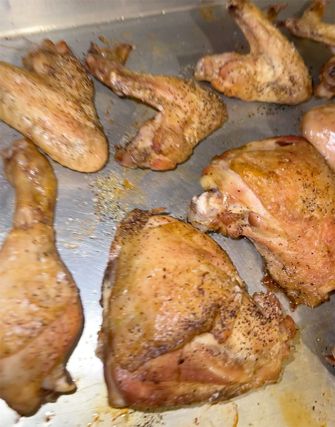

import Callout from '@/components/Callout.astro'

Saleeg is the considered one of the national dishes of the Hejaz region, and is one of my favorite dishes of all time.
Its one of the best things you could ever eat in your whole life. NO it is not comparable to risotto its beyond that.

## Ingredients

### Big Items
- 3 cups basmati rice
- 4 lbs chicken (dark meat preferred), cut into pieces
- 1 container (32 oz) low-sodium chicken stock

#### Small Items
- 5 small pieces mastic (mistika)
- 1 tablespoon whole black peppercorns
- 6-8 green cardamom pods
- 2 whole cloves
- ½ teaspoon allspice berries
- 1 small cinnamon stick
- 1 garlic clove
- ½ teaspoon Cajun seasoning
- Cooking Spray

#### Creamy Items
- ½ cup powdered milk 
- ½ cup heavy cream 
- 1 cup whole milk
- Additional whole milk as needed
- Butter

### Duggus Items
- 2 juicy ripe tomato
- 1 garlic clove
- 2 small green chilies, de seeded
- 1 handful cilantro
- Juice of 1 lemon
- 1 tablespoon olive oil
- Salt to taste

## Instructions

### Step 1: Prepare the Chicken
Pat chicken dry and season with salt and cajun seasoning. In a large, heavy-bottomed pot, render any chicken fat over medium heat. Melt the mastic into fat. Sear chicken pieces until lightly golden (light tan color, not deep brown). Remove chicken and set aside.
<Callout variant="warning">
If you do not sear the chicken correctly it will taste like boiled chicken.
</Callout>

### Step 2: Toast the Spices
Add all the chicken back, along with all the whole spices except garlic (peppercorns, cardamom, cloves, allspice, cinnamon). Saute and move around for a minute, then cover it and let it saute for 5 minutes on same heat.

### Step 3: Braise the Chicken
Add whole garlic clove and the entire container of chicken stock. Add enough water to just cover the chicken.

### Step 4: Simmer
Bring to a boil, then immediately reduce to a slow simmer. Cook for 25 minutes for dark meat (15 minutes for white meat).
<Callout variant="warning">
Let it slow simmer or else meat will become tough.
</Callout>
### Step 5: Rest and Strain
Remove chicken and place on a tray to air dry. Strain the broth through a fine-mesh strainer, discarding solids. You'll need 12 cups of this seasoned broth for 3 cups of rice (4:1 ratio).

### Step 6: Cook the Rice
Bring the strained broth to a boil in a pot. Add the washed rice and return to a boil. Immediately reduce heat to low and cook without stirring for 22 minutes.

### Step 7: Add Powdered Milk
Stir in the powdered milk. Continue stirring gently on low heat, watching the starch break and come out. Add heavy cream. Stir for 5 minutes until rice thickens.

### Step 8: Rest
Remove from heat and let sit covered for 20 minutes to absorb remaining liquid and develop the proper creamy texture.

### Step 9: Finish the Chicken
While rice rests, spray or brush chicken with oil or melted butter and sprinkle with salt. Pop in the oven to crisp up.

### Step 10: Make the Duggus
In a food processor, pulse together all the duggus ingredients.

### Step 11: Serve
Serve the creamy saleeg in bowls topped with the seasoned chicken. Provide the fresh duggus on the side for guests to add as desired. Add Crystal hot sauce or any vinegary hot sauce.

  

    
  

  

    
  

## Tips

- **Rice texture**: The final saleeg should be creamy like risotto, not dry like regular rice. You can add whole milk to try and make it more liquidy if its too dry.
- **Microwaving leftovers**: You can add milk to the cold leftovers and microwave it to get a creamy texture again.
- **Broth ratio**: Always use a 4:1 ratio of liquid to rice for proper creaminess  
- **Don't rush**: The slow simmer and resting periods are crucial for developing flavor and texture
- **Strain well**: Removing the whole spices gives a clean, smooth final dish
- **Fresh duggus**: Make the salsa just before serving to maintain its bright, fresh flavor
